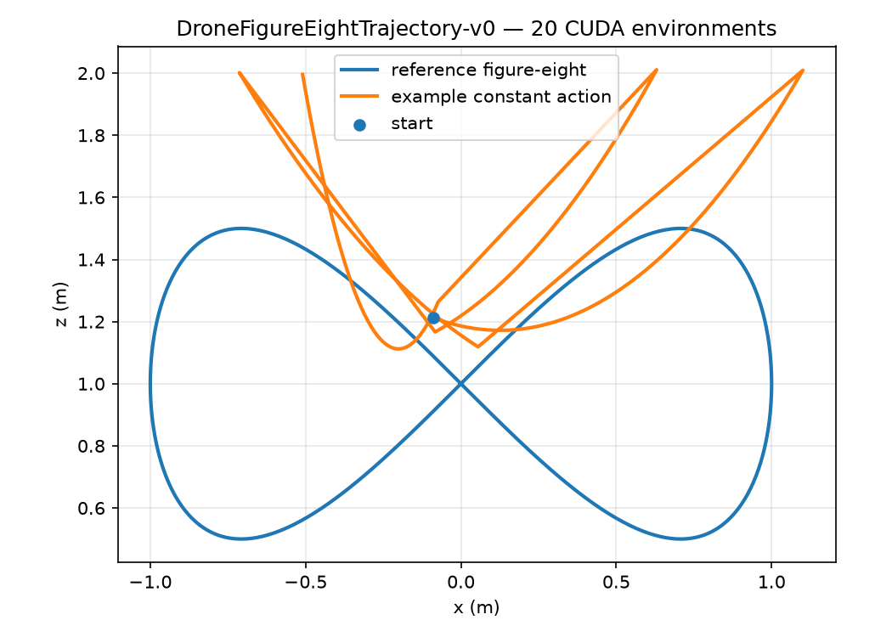

# Crazyflow 完整使用手册

本文覆盖 Crazyflow 官方 [User Guide](https://learnsyslab.github.io/crazyflow/user-guide/)、[Examples](https://learnsyslab.github.io/crazyflow/examples/) 的全部主题，以及仓库中官网首页未单独列出的示例。所有命令与结果均在 2026-08-12 使用本仓库的 CUDA 容器实际验证。

> 镜像构建、容器启动和常用命令见 [`note.md`](note.md)。本文专注 Crazyflow API、示例、可视化和 drone racing 的具体用法。

## 验证环境

| 项目 | 实际环境 |
|---|---|
| 镜像 | `dzp_crazyflow:0.3.2-cuda12.6-py312-racing-rl` |
| Python | 3.12.13 |
| Crazyflow | 0.3.0，可编辑安装自 `/workspace/crazyflow` |
| GPU | NVIDIA GeForce RTX 4070 Ti SUPER 16 GiB |
| CUDA | 基础镜像与 `nvcc` 12.6；驱动 580.126.09 |
| JAX | 0.11.0，默认后端 `gpu`，设备 `cuda:0` |
| PyTorch | 2.8.0+cu126，`torch.version.cuda == "12.6"` |
| MuJoCo / MJX | 3.10.0 / 3.10.0 |
| Gaussian splat | splax + Warp 1.16.0，CUDA rasterizer |
| drone racing | `065a6ecb7a7621f156bdd0bedc70020e3331a3e9` |

进入已启动的容器：

```bash
docker exec -it dzp-crazyflow bash
cd /workspace/crazyflow
```

快速确认计算确实发生在 GPU：

```python
import jax
import jax.numpy as jnp
import torch

x = (jnp.ones((1024, 1024)) @ jnp.ones((1024, 1024))).block_until_ready()
y = torch.ones((1024, 1024), device="cuda") @ torch.ones((1024, 1024), device="cuda")

print(jax.default_backend(), x.device)       # gpu cuda:0
print(torch.__version__, y.device)           # 2.8.0+cu126 cuda:0
```

## 1. 模拟器数据模型

### 1.1 Worlds × drones

Crazyflow 把状态组织成 `n_worlds × n_drones × feature_dim`。world 是彼此独立的并行环境，drone 是同一个 world 中同步推进的多架无人机。

```python
from crazyflow.sim import Sim

sim = Sim(n_worlds=4, n_drones=2, device="gpu")
sim.reset()

print(sim.data.states.pos.shape)     # (4, 2, 3)
print(sim.data.states.quat.shape)    # (4, 2, 4)
print(sim.data.states.pos[2, 0])     # world 2, drone 0
sim.close()
```

`SimData` 的主要子树如下：

| 字段 | 作用 |
|---|---|
| `states` | 位置、姿态、速度、角速度、外力、外力矩、转子速度 |
| `states_deriv` | 当前动力学导数 |
| `controls` | 已暂存的控制命令、控制器频率和积分状态 |
| `params` | 质量、惯量、电机和阻力等物理参数 |
| `core` | 步数、频率、随机数 key、设备和 MuJoCo 同步标志 |
| `plugins` | 用户插件数据，如动作队列、估计状态、Gaussian splat |

状态约定：

| 字段 | 尾维 | 单位/约定 |
|---|---:|---|
| `pos` | 3 | 世界坐标，m |
| `quat` | 4 | `xyzw` 四元数 |
| `vel` | 3 | 世界坐标，m/s |
| `ang_vel` | 3 | 机体坐标，rad/s |
| `force` | 3 | 世界坐标，N |
| `torque` | 3 | 机体坐标，N·m |
| `rotor_vel` | 4 | RPM；部分拟合模型中保存推力状态 |

### 1.2 不可变更新

JAX 数组和 `SimData` 不做原地修改。使用嵌套的 `.replace()` 和 `.at[]`：

```python
import jax.numpy as jnp
from crazyflow.sim import Sim

sim = Sim(n_worlds=4, n_drones=1, device="gpu")
sim.reset()
new_pos = sim.data.states.pos.at[:, 0, 2].set(jnp.array([0.2, 0.4, 0.6, 0.8]))
sim.data = sim.data.replace(states=sim.data.states.replace(pos=new_pos))
```

这也是 `SimData` 能直接传入 `jax.jit`、`jax.grad`、`jax.vmap` 和 `jax.lax.scan` 的基础。

### 1.3 仿真与控制频率

`freq` 是动力学频率；各层控制器按自己的频率触发。以 500 Hz 动力学、100 Hz state controller 为例，一个控制周期对应 5 个动力学步：

```python
import numpy as np
from crazyflow.control import Control
from crazyflow.sim import Sim

sim = Sim(freq=500, state_freq=100, control=Control.state, device="gpu")
sim.reset()
cmd = np.zeros((1, 1, 13), dtype=np.float32)
cmd[..., 2] = 0.5
sim.state_control(cmd)
sim.step(sim.freq // sim.control_freq)  # 5 个动力学步，state controller 触发一次
```

把固定数量的多步一次交给 `sim.step(n_steps)`，通常比 Python 循环调用 `step(1)` 更快。改变 `n_steps` 会产生新的 JIT 编译版本。

## 2. 面向对象 API

### 2.1 创建模拟器

```python
from crazyflow.control import Control
from crazyflow.sim import Dynamics, Sim
from crazyflow.sim.integration import Integrator

sim = Sim(
    n_worlds=8,
    n_drones=2,
    drone="cf21B_500",
    dynamics=Dynamics.first_principles,
    control=Control.state,
    integrator=Integrator.rk4,
    freq=500,
    state_freq=100,
    attitude_freq=500,
    device="gpu",
)
sim.reset()
```

可选积分器为 `euler`、`rk4` 和 `symplectic_euler`。随包提供的机型为：

```python
from crazyflow.drones import available_drones

print(available_drones)
# ('cf2x_L250', 'cf2x_P250', 'cf2x_T350', 'cf21B_500')
```

### 2.2 四种控制模式

所有 OO 控制方法的输入都包含 `(n_worlds, n_drones, command_dim)`。

| 模式 | 方法 | 命令 | 动力学限制 |
|---|---|---|---|
| state | `state_control` | 13D：位置、速度、加速度、yaw、角速度 | 全部动力学 |
| attitude | `attitude_control` | 4D：roll、pitch、yaw、总推力 N | 全部动力学 |
| force/torque | `force_torque_control` | 4D：总力 N、三个力矩 N·m | 仅 first-principles |
| rotor velocity | `rotor_vel_control` | 四电机 RPM | 仅 first-principles |

```python
import numpy as np
from crazyflow.control import Control
from crazyflow.sim import Dynamics, Sim

# State command: [x,y,z, vx,vy,vz, ax,ay,az, yaw, p_rate,q_rate,r_rate]
state_sim = Sim(control=Control.state, device="gpu")
state_sim.reset()
state_cmd = np.zeros((1, 1, 13), np.float32)
state_cmd[..., :3] = [0.4, 0.2, 0.8]
state_sim.state_control(state_cmd)
state_sim.step(500)
print(state_sim.data.states.pos[0, 0])
# [0.4085227, 0.19770256, 0.80500567]

# Attitude command: [roll, pitch, yaw, thrust]
att_sim = Sim(control=Control.attitude, dynamics=Dynamics.so_rpy, device="gpu")
att_sim.reset()
att_cmd = np.zeros((1, 1, 4), np.float32)
att_cmd[..., 3] = float(att_sim.data.params.mass[0, 0, 0]) * 9.81
att_sim.attitude_control(att_cmd)
att_sim.step(att_sim.freq // att_sim.control_freq)

# Force/torque command: [collective_force, tx, ty, tz]
ft_sim = Sim(control=Control.force_torque, dynamics=Dynamics.first_principles, device="gpu")
ft_sim.reset()
ft_cmd = np.zeros((1, 1, 4), np.float32)
ft_cmd[..., 0] = float(ft_sim.data.params.mass[0, 0, 0]) * 9.81
ft_sim.force_torque_control(ft_cmd)
ft_sim.step(1)

# Rotor command: [rpm0, rpm1, rpm2, rpm3]
rpm_sim = Sim(control=Control.rotor_vel, dynamics=Dynamics.first_principles, device="gpu")
rpm_sim.reset()
rpm_sim.rotor_vel_control(np.full((1, 1, 4), 15_000.0, np.float32))
rpm_sim.step(1)
```


### 2.3 Step、局部 reset 和读取状态

```python
import jax.numpy as jnp
import numpy as np
from crazyflow.control import Control
from crazyflow.sim import Sim

sim = Sim(n_worlds=4, n_drones=3, control=Control.state, device="gpu")
sim.reset()
cmd = np.zeros((4, 3, 13), np.float32)
cmd[..., 2] = 0.5
sim.state_control(cmd)
sim.step(50)

# 只重置 world 0 和 2；另外两个 world 连续运行
sim.reset(mask=jnp.array([True, False, True, False]))

pos = sim.data.states.pos          # (4, 3, 3)
pos_world0_drone1 = pos[0, 1]     # (3,)
```

## 3. Functional API 与 JAX 变换

OO 方法会修改 `sim.data`，不应直接放进 JAX 变换。Functional API 显式接收和返回 `SimData`。

| 函数 | 作用 |
|---|---|
| `F.state_control` | 暂存 13D state command |
| `F.attitude_control` | 暂存 4D attitude command |
| `F.force_torque_control` | 暂存 4D force/torque command |
| `F.rotor_vel_control` | 暂存 4 路 RPM |
| `F.controllable` | 返回当前可触发控制更新的 world mask |
| `sim.build_step_fn()` | 构造 `(data, n_steps) -> data` 的 JIT 函数 |
| `sim.build_reset_fn()` | 构造 `(data, default_data, mask) -> data` 的 JIT 函数 |

### 3.1 JIT 编译 rollout

```python
import jax
import jax.numpy as jnp
import crazyflow.sim.functional as F
from crazyflow.control import Control
from crazyflow.sim import Sim

sim = Sim(n_worlds=1, n_drones=1, control=Control.attitude, device="gpu")
sim.reset()
data, default_data = sim.data, sim.default_data
step, reset = sim.build_step_fn(), sim.build_reset_fn()

cmd = jnp.zeros((1, 1, 4), dtype=jnp.float32)
cmd = cmd.at[..., 3].set(float(data.params.mass[0, 0, 0]) * 9.81)

@jax.jit
def rollout(data, default_data, cmd):
    data = reset(data, default_data)
    data = F.attitude_control(data, cmd)
    return step(data, 100)

data = rollout(data, default_data, cmd)
print(data.states.pos.shape, data.states.pos.device)  # (1, 1, 3), cuda:0
```

### 3.2 对完整动力学求梯度

```python
import jax
import jax.numpy as jnp
from crazyflow.control import Control
from crazyflow.sim import Sim

sim = Sim(control=Control.attitude, attitude_freq=50, device="gpu")
sim.reset()
data = sim.data.replace(
    states=sim.data.states.replace(pos=sim.data.states.pos.at[..., 2].set(0.5))
)
step = sim.build_step_fn()

def loss(cmd, data):
    data = data.replace(
        controls=data.controls.replace(
            attitude=data.controls.attitude.replace(staged_cmd=cmd)
        )
    )
    data = step(data, 10)
    return (data.states.pos[0, 0, 2] - 1.0) ** 2

grad_fn = jax.jit(jax.grad(loss))
cmd = jnp.zeros((1, 1, 4), dtype=jnp.float32)
cmd = cmd.at[..., 3].set(data.params.mass[0, 0, 0] * 9.81 * 1.05)
grad = grad_fn(cmd, data)
```

原版 `examples/jax/gradient.py` 实测：10 次梯度更新耗时 `3.76e-4 s`，平均 `3.76e-5 s/step`；最终 loss 为 `0.25175005`，推力梯度为 `-4.1913e-5`。

### 3.3 持久 JAX 编译缓存

```python
from crazyflow.utils import enable_cache

enable_cache()  # 默认 /tmp/jax_cache-<uid>
```

运行 [`examples/jax/cache.py`](examples/jax/cache.py) 会交替创建和删除示例缓存。第三次有缓存运行的实测初始化/首步为 `0.538 s / 0.235 s`；无缓存运行为 `0.815 s / 0.368 s`。实际收益取决于函数是否达到持久缓存阈值和其他 XLA 缓存是否已预热。

## 4. 动力学库

### 4.1 模型选择与控制兼容性

```python
from crazyflow.sim import Dynamics, Sim

sim = Sim(dynamics=Dynamics.so_rpy_rotor_drag, control="attitude", device="gpu")
```

| 动力学 | 输入 | 转子动态 | 阻力 | state / attitude | force-torque / RPM |
|---|---|---:|---:|---:|---:|
| `first_principles` | 4 路 RPM | ✓ | ✓ | ✓ | ✓ |
| `so_rpy` | RPY + thrust | — | — | ✓ | — |
| `so_rpy_rotor` | RPY + thrust | ✓ | — | ✓ | — |
| `so_rpy_rotor_drag` | RPY + thrust | ✓ | ✓ | ✓ | — |

`Dynamics.default` 是 `first_principles`。force/torque 或 rotor velocity 配合拟合模型会在构造时抛出 `ConfigError`。

### 4.2 独立调用动力学函数

```python
import numpy as np
from crazyflow.dynamics import parametrize
from crazyflow.dynamics.first_principles import dynamics

fn = parametrize(dynamics, drone="cf2x_L250")
pos = vel = ang_vel = np.zeros(3)
quat = np.array([0.0, 0.0, 0.0, 1.0])
cmd = np.full(4, 15_000.0)
rotor_vel = np.full(4, 12_000.0)

pos_dot, quat_dot, vel_dot, ang_vel_dot, rotor_vel_dot = fn(
    pos, quat, vel, ang_vel, cmd, rotor_vel
)
```

拟合动力学的命令是 `[roll, pitch, yaw, thrust_N]`：

```python
from crazyflow.dynamics import parametrize
from crazyflow.dynamics.so_rpy_rotor_drag import dynamics

fn = parametrize(dynamics, "cf2x_L250")
cmd = np.array([0.0, 0.0, 0.0, 0.31])
thrust_state = np.full(4, 0.31)
derivatives = fn(pos, quat, vel, ang_vel, cmd, thrust_state)
```

四种模型都接受可选的世界坐标外力 `dist_f` 和机体坐标外力矩 `dist_t`。`so_rpy` 没有 rotor state，因此只返回 4 项导数。可查询特性：

```python
from crazyflow.dynamics import dynamics_features
from crazyflow.dynamics.first_principles import dynamics as fp
from crazyflow.dynamics.so_rpy import dynamics as srpy

print(dynamics_features(fp))    # {'rotor_dynamics': True}
print(dynamics_features(srpy))  # {'rotor_dynamics': False}
```

### 4.3 参数加载、覆盖与后端

```python
from crazyflow.dynamics import available_dynamics, load_params, parametrize

raw = load_params(available_dynamics["first_principles"], "cf2x_L250")
print(raw["mass"])  # 物理和当前模型参数合并后的值

fn = parametrize(available_dynamics["first_principles"], "cf2x_L250")
result = fn(pos, quat, vel, ang_vel, cmd, rotor_vel, mass=0.0419)  # 只覆盖本次调用
fn.keywords["mass"] = np.float64(0.040)                           # 持久覆盖
```

JAX 参数可直接放到 GPU：

```python
import jax
import jax.numpy as jnp
from crazyflow.dynamics import parametrize
from crazyflow.dynamics.first_principles import dynamics

fn = parametrize(dynamics, "cf2x_L250", xp=jnp, device=jax.devices("gpu")[0])
```

PyTorch CUDA 调用还应设置默认设备，因为函数内部会创建临时标量：

```python
import torch
from crazyflow.dynamics import parametrize
from crazyflow.dynamics.first_principles import dynamics

torch.set_default_device("cuda")
fn = parametrize(dynamics, "cf2x_L250", xp=torch, device="cuda")
out = fn(
    torch.zeros(3),
    torch.tensor([0.0, 0.0, 0.0, 1.0]),
    torch.zeros(3),
    torch.zeros(3),
    torch.full((4,), 15_000.0),
    torch.full((4,), 12_000.0),
)
assert all(x.device.type == "cuda" for x in out)
```

### 4.4 批处理与 domain randomization

动力学对任意前导维广播，不需要额外 batch 参数：

```python
import jax.numpy as jnp
from crazyflow.dynamics import parametrize
from crazyflow.dynamics.first_principles import dynamics

fn = parametrize(dynamics, "cf2x_L250", xp=jnp)
pos = jnp.zeros((50, 20, 3))
quat = jnp.broadcast_to(jnp.array([0.0, 0.0, 0.0, 1.0]), (50, 20, 4))
vel = ang_vel = jnp.zeros((50, 20, 3))
cmd = rotor_vel = jnp.full((50, 20, 4), 15_000.0)
vel_dot = fn(pos, quat, vel, ang_vel, cmd, rotor_vel)[2]
assert vel_dot.shape == (50, 20, 3)
```

JIT 下随机化参数的推荐方式是把 `mass`、`J`、`J_inv` 作为运行时 keyword argument 传入，避免每次随机化都重新编译：

```python
import jax

@jax.jit
def randomized_dynamics(pos, quat, vel, ang_vel, cmd, rotor_vel, mass, J, J_inv):
    return fn(
        pos, quat, vel, ang_vel, cmd, rotor_vel,
        mass=mass, J=J, J_inv=J_inv,
    )
```

### 4.5 CasADi 符号动力学

每种动力学都提供 `symbolic_dynamics`；拟合模型还提供原生 Euler 状态的 `symbolic_dynamics_euler`。

```python
import casadi as cs
from crazyflow.dynamics import parametrize
from crazyflow.dynamics.first_principles import symbolic_dynamics

symbolic = parametrize(symbolic_dynamics, "cf2x_L250")
X_dot, X, U, Y = symbolic(
    model_rotor_vel=True,
    model_dist_f=False,
    model_dist_t=False,
)
f = cs.Function("f", [X, U], [X_dot])
```

First-principles 且建模 rotor velocity 时，`X` 为 17D：`pos(3), quat(4), vel(3), ang_vel(3), rotor_vel(4)`。同时打开 `model_dist_f` 和 `model_dist_t` 后为 23D。

```python
from crazyflow.dynamics.so_rpy_rotor_drag import symbolic_dynamics_euler

symbolic_euler = parametrize(symbolic_dynamics_euler, "cf2x_L250")
X_dot, X, U, Y = symbolic_euler(model_rotor_vel=True)
```

Euler 版本状态为 `pos(3), rpy(3), vel(3), drpy(3), thrust_state(4)`。原版 [`examples/symbolic.py`](examples/symbolic.py) 还用 `cs.integrator("fd", "cvodes", ...)` 完成了离散积分；实测 `X_dot/X/U/Y` 分别为 `(13,1)/(13,1)/(4,1)/(7,1)`。

### 4.6 系统辨识

输入 flight log 至少包含：

| key | shape | 含义 |
|---|---:|---|
| `time` | `(N,)` | 时间戳，s |
| `pos` | `(N,3)` | 世界坐标位置，m |
| `quat` | `(N,4)` | `xyzw` |
| `cmd_rpy` | `(N,3)` | RPY 命令，rad |
| `cmd_f` | `(N,)` | 总推力命令，N |

```python
from crazyflow.dynamics.utils.data_utils import derivatives_svf, preprocessing
from crazyflow.dynamics.utils.identification import sys_id_rotation, sys_id_translation

data = preprocessing(raw_flight_log)
data = derivatives_svf(data)

trans_params = sys_id_translation(
    dynamics="so_rpy_rotor_drag",
    mass=0.0319,
    data=data,
    data_validation=validation_data,  # 可选；应使用独立飞行轨迹
    verbose=0,
    plot=True,
)
rot_params = sys_id_rotation(data=data, verbose=0, plot=True)
```

完整合成数据流水线已对 `so_rpy`、`so_rpy_rotor`、`so_rpy_rotor_drag` 和旋转辨识逐一执行。下图仅用于证明绘图/API 链路；合成的周期信号不是可靠 flight log，因此图中低 R² 不代表辨识器精度。实际使用应以独立真实轨迹做 validation。


## 5. 控制器库

Mellinger 控制链是三个纯函数：

```text
state2attitude -> attitude2force_torque -> force_torque2rotor_vel
```

### 5.1 State → attitude

```python
import numpy as np
from crazyflow.control import parametrize
from crazyflow.control.mellinger import state2attitude

ctrl = parametrize(state2attitude, "cf2x_L250")
pos = vel = np.zeros(3)
quat = np.array([0.0, 0.0, 0.0, 1.0])
cmd = np.zeros(13)
cmd[:3] = [0.0, 0.0, 1.0]
rpyt, pos_err_i = ctrl(pos, quat, vel, cmd)
assert rpyt.shape == (4,) and pos_err_i.shape == (3,)
```

### 5.2 Attitude → force/torque

```python
from crazyflow.control.mellinger import attitude2force_torque

ctrl = parametrize(attitude2force_torque, "cf2x_L250")
force, torque, r_int_error = ctrl(
    quat,
    np.zeros(3),
    np.array([0.0, 0.0, 0.0, 0.3]),
)
assert force.shape == (1,) and torque.shape == (3,)
```

### 5.3 Force/torque → RPM

```python
from crazyflow.control.mellinger import force_torque2rotor_vel

ctrl = parametrize(force_torque2rotor_vel, "cf2x_L250")
rpm = ctrl(np.array([0.2]), np.zeros(3))
assert rpm.shape == (4,)
```

### 5.4 积分误差、参数化、批处理与 JIT

控制器无隐藏状态。需要把 `pos_err_i` 和 `r_int_error` 显式传到下一次调用：

```python
pos_err_i = np.zeros(3)
for _ in range(10):
    rpyt, pos_err_i = state_ctrl(pos, quat, vel, cmd, pos_err_i=pos_err_i)
```

在 `jax.jit` 下从第一次调用就传零数组，避免 `None → Array` 改变参数树而重复编译：

```python
import jax
import jax.numpy as jnp
from crazyflow.control import parametrize
from crazyflow.control.mellinger import state2attitude

ctrl = jax.jit(parametrize(state2attitude, "cf2x_L250", xp=jnp))
rpyt, err = ctrl(
    jnp.zeros((1000, 3)),
    jnp.broadcast_to(jnp.array([0.0, 0.0, 0.0, 1.0]), (1000, 4)),
    jnp.zeros((1000, 3)),
    jnp.zeros((1000, 13)),
    pos_err_i=jnp.zeros((1000, 3)),
)
assert rpyt.shape == (1000, 4)
```

参数加载和单次/持久覆盖方式与动力学一致：

```python
from crazyflow.control import load_params, parametrize
from crazyflow.control.mellinger import state2attitude

params = load_params(state2attitude, "cf2x_L250")
ctrl = parametrize(state2attitude, "cf2x_L250")
rpyt, _ = ctrl(pos, quat, vel, cmd, mass=0.035)  # 单次覆盖
ctrl.keywords["mass"] = np.float64(0.035)       # 持久覆盖
```

## 6. Step/reset pipelines 与插件

`step_pipeline` 和 `reset_pipeline` 都是有名字且顺序固定的纯函数字典。默认 first-principles + attitude 的 step stages 为：

```python
from crazyflow.sim import Sim

sim = Sim()
print(tuple(sim.step_pipeline))
# ('attitude_controller', 'force_torque_controller', 'integration',
#  'increment_steps', 'clip_floor_pos')
```

Pipeline 操作 API：

| 函数 | 作用 |
|---|---|
| `append_fn` / `prepend_fn` | 追加/前置 stage |
| `insert_fn_before` / `insert_fn_after` | 相对某个命名 stage 插入 |
| `replace_fn` | 替换命名 stage |
| `remove_fn` | 删除命名 stage |

修改后必须调用对应的 `build_step_fn()` 或 `build_reset_fn()` 重新编译。

### 6.1 扰动注入

```python
import jax
from crazyflow.sim import Sim
from crazyflow.sim.data import SimData
from crazyflow.sim.pipeline import insert_fn_before

def disturbance(data: SimData) -> SimData:
    key, subkey = jax.random.split(data.core.rng_key)
    force = jax.random.normal(subkey, data.states.force.shape) * 0.2
    return data.replace(
        states=data.states.replace(force=force),
        core=data.core.replace(rng_key=key),
    )

sim = Sim(control="state", device="gpu")
insert_fn_before(sim.step_pipeline, "integration", disturbance)
sim.build_step_fn()
```

原版 [`examples/plugins/disturbance.py`](examples/plugins/disturbance.py) 的 3 秒对照 rollout 如下，虚线为每个动力学 tick 注入随机力和力矩后的结果：


### 6.2 Reset randomization 与 mask

```python
import jax
from jax import Array
from crazyflow.sim import Sim
from crazyflow.sim.data import SimData
from crazyflow.sim.pipeline import append_fn
from crazyflow.utils import leaf_replace

def randomize_mass(data: SimData, default_data: SimData, mask: Array | None) -> SimData:
    key, subkey = jax.random.split(data.core.rng_key)
    mass = data.params.mass + jax.random.normal(subkey, data.params.mass.shape) * 2e-3
    return data.replace(
        params=leaf_replace(data.params, mask, mass=mass),
        core=data.core.replace(rng_key=key),
    )

sim = Sim(n_worlds=16, device="gpu")
append_fn(sim.reset_pipeline, randomize_mass)
sim.build_reset_fn()
sim.reset()  # 全部 world
sim.reset(mask=jax.numpy.array([True] + [False] * 15))
```

Reset stage 的签名必须是 `(data, default_data, mask) -> data`。使用 `leaf_replace` 才能正确遵守局部 reset mask。

### 6.3 自定义 plugin state：动作延迟

插件状态保存在 `data.plugins` 中，并在 `build_default_data()` 后跨 reset 保留：

```python
import jax.numpy as jnp
from crazyflow.sim import Sim
from crazyflow.sim.pipeline import prepend_fn

sim = Sim(control="state", device="gpu")
delay_steps = int(0.03 * sim.data.controls.attitude.freq)
sim.data = sim.data.replace(
    plugins=sim.data.plugins | {
        "queued_actions": jnp.zeros((delay_steps, 1, 1, 4))
    }
)
prepend_fn(sim.step_pipeline, action_delay, name="action_delay")
sim.build_default_data()
sim.build_step_fn()
```

原版 [`examples/plugins/action_delay.py`](examples/plugins/action_delay.py) 实测 30 ms attitude delay 使两条轨迹的平均位置差为 `27.93 cm`。

### 6.4 UWB 状态估计插件

[`examples/plugins/estimation.py`](examples/plugins/estimation.py) 演示了完整的 pipeline 组合：

1. `simulate_uwb` 在 pipeline 开头生成 8 基站测距。
2. `estimate_state` 用 constant-velocity EKF 更新位置/速度和 covariance。
3. `use_estimate_for_control` 临时把估计状态暴露给控制器。
4. `restore_ground_truth` 在积分前恢复真实物理状态。

20 秒完整 rollout 的结果：

| 测量 | Tracking RMS | Estimation RMS |
|---|---:|---:|
| 理想 UWB | 0.083 m | 0.001 m |
| 3 cm 噪声 + 最大 8 cm bias | 0.770 m | 0.028 m |

## 7. MuJoCo / MJX 集成

Crazyflow 的动力学由 JAX 计算；MuJoCo/MJX 负责场景、相机、光照、碰撞和可视化。

| 对象 | 用途 |
|---|---|
| `sim.spec` | 可编辑的 `mujoco.MjSpec` 场景 |
| `sim.mj_model`, `sim.mj_data` | CPU MuJoCo 模型和渲染 buffer |
| `sim.mjx_model`, `sim.mjx_data` | JAX/MJX 场景和 world batch |

### 7.1 Fused drone mesh

```python
sim = Sim(n_worlds=1, n_drones=17, fused_mjx_model=True)
```

`fused_mjx_model=True` 把分离的 PCB、电机、桨叶、LED 和电池视觉 mesh 合并，减少大规模 swarm 的 MuJoCo/MJX 内存；只改变视觉细节，不改变动力学。

### 7.2 运行时挂载 MJCF 对象

```python
import mujoco
from crazyflow.sim import Sim

sim = Sim(device="gpu")
obstacle_spec = mujoco.MjSpec.from_string("""
<mujoco>
  <worldbody>
    <body name="obstacle">
      <geom type="box" size="0.1 0.1 0.1" rgba="0.9 0.15 0.1 1"/>
    </body>
  </worldbody>
</mujoco>
""")

frame = sim.spec.worldbody.add_frame()
for i, pos in enumerate(([0.3, -0.18, 0.25], [0.3, 0.18, 0.55])):
    body = obstacle_spec.body("obstacle")
    attached = frame.attach_body(body, "", f":{i}")
    attached.pos = pos

sim.build_mjx()
sim.reset()
```


从文件读取时使用 `mujoco.MjSpec.from_file(path)`。需要运行时移动对象时，把 body 设为 mocap，再更新 `sim.mjx_data.mocap_pos` / `mocap_quat`。

### 7.3 同步和 contacts

`sim.step()` / `sim.reset()` 只更新 JAX state，并把 `mjx_synced` 设为 false。第一次 `sim.render()` 或 `sim.contacts()` 会执行位置/四元数同步、kinematics、camlight 和 collision；同一 tick 中的后续查询复用结果：

```python
sim.step(5)
contacts = sim.contacts()                 # 在这里同步一次
rgb = sim.render(mode="rgb_array")       # 复用已同步的 MJX data
```

紧循环里不要把整个 `mjx_data` 当作动态 JIT 参数；可以闭包捕获它，只把小型 `SimData` 与 obstacle position 作为输入。

### 7.4 Sphere/box collision

```python
from crazyflow.sim.sim import use_box_collision

use_box_collision(sim, enable=True)
contacts = sim.contacts()  # (n_worlds, n_contact_slots) bool
```

默认 sphere 适合快速保守检查；oriented box 更贴合机身，适合窄通道和碰撞调试。交互式 `contacts.py` 已完整渲染 120 帧并检查 `sim.contacts()`：


## 8. MuJoCo 可视化、相机、材质与 raycasting

### 8.1 Render modes

| mode | 返回值 |
|---|---|
| `human` | X11 交互窗口，返回 `None` |
| `rgb_array` | `(H,W,3) uint8` |
| `depth_array` | `(H,W) float32` |
| `rgbd_tuple` | `(rgb, depth)` |

```python
rgb = sim.render(mode="rgb_array", camera="fpv_cam:0", width=320, height=240)
sim.close()
depth = sim.render(mode="depth_array", camera=0, width=320, height=240)
sim.close()
rgb, depth = sim.render(mode="rgbd_tuple", camera="track_cam:0", width=160, height=120)
sim.close()
```

重要：同一个 `Sim` 会缓存第一次创建的 renderer、相机和尺寸。若要切换 camera、mode 对应的离屏配置或分辨率，应先 `sim.close()` 再 render。`world=3` 可选择第 4 个并行 world；一次只渲染一个 world。

FPV 相机跟随机体。原版 [`examples/rendering/cameras.py`](examples/rendering/cameras.py) 完整保存 250 帧 RGB-D，实测平均 render time `8.02 ms`，约 `124.64 fps`：


### 8.2 Human viewer 和 camera config

```python
sim.render(
    mode="human",
    camera="track_cam:0",
    cam_config={
        "distance": 3.0,
        "elevation": -45.0,
        "azimuth": 90.0,
        "lookat": [0.0, 0.0, 1.0],
    },
)
```

容器验证的 OpenGL renderer 为 NVIDIA RTX 4070 Ti SUPER，OpenGL 4.6，direct rendering 开启。

### 8.3 动态材质

```python
import numpy as np
from crazyflow.sim.visualize import change_material

ids = np.arange(sim.n_drones)
rgba = np.random.default_rng(0).uniform(0, 1, (sim.n_drones, 4))
rgba[:, 3] = 1.0
change_material(sim, "led_top", ids, rgba=rgba, emission=1.0)
change_material(sim, "led_bot", ids, rgba=rgba[::-1], emission=0.8)
```


### 8.4 Raycasting depth

```python
from crazyflow.sim.sensors.depth import build_render_depth_fn, render_depth

depth = render_depth(sim, camera=0, resolution=(100, 100), include_drone=False)

render_depth_compiled = build_render_depth_fn(
    sim.mjx_model,
    camera=0,
    resolution=(200, 200),
    geomgroup=(1, 1, 0, 1, 1, 1, 1, 1),
)
depth_fast = render_depth_compiled(sim)
```

返回 shape 为 `(n_worlds, H, W)`。实测 100×100 和编译后的 200×200 路径分别得到 6,390 与 26,816 个小于 1.5 m 的有效 ray：


## 9. Gaussian Splat Rendering

容器已经包含 `crazyflow[splats]`、splax viewer 和 CUDA rasterizer。独立安装可用：

```bash
pip install "crazyflow[splats]"
```

Web viewer 可在任意设备显示；splat camera sensor 必须使用 NVIDIA GPU。

### 9.1 下载并挂载 splats

```python
from splax.io import fetch
from crazyflow.sim import Sim
from crazyflow.sim.splat import attach_splats

assets = "https://huggingface.co/datasets/amacati/splats/resolve/main"
scene = fetch(f"{assets}/robot_hall.ply")
drone = fetch(f"{assets}/cf2x_L250.ply")

sim = Sim(n_worlds=2, n_drones=2, control="state", device="gpu")
attach_splats(sim, scene=scene, drone=drone)
```

资产首次下载到 `~/.cache/splax`，可用 `SPLAX_CACHE` 改位置。scene 与 MuJoCo world 坐标系对齐；drone splat 与机体系、质心对齐。挂载后的数组和每架 drone 的 buffer slice 存在 `sim.data.plugins`，会随 JIT data 和 reset 保留。

### 9.2 Batched RGB camera

```python
from crazyflow.sim.sensors.splat import build_render_splat_fn, render_splat_rgb

images = render_splat_rgb(sim, resolution=(320, 240))
assert images.shape == (2, 2, 240, 320, 3)

render_rgb = build_render_splat_fn(
    sim,
    resolution=(160, 120),
    exclude_self=True,
)
images = render_rgb(sim.data)  # 纯函数，可 JIT/grad
```

实测像素范围 `0.000117–0.999924`，四路 FPV 如下：


### 9.3 RGB-D camera

```python
from crazyflow.sim.sensors.splat import build_render_splat_rgbd_fn, render_splat_rgbd

rgbd = render_splat_rgbd(
    sim,
    drones=0,
    resolution=(320, 240),
    max_range=8.0,
)
assert rgbd.shape == (2, 1, 240, 320, 4)
rgb, depth = rgbd[..., :3], rgbd[..., 3]

render_rgbd = build_render_splat_rgbd_fn(
    sim,
    drones=0,
    resolution=(160, 120),
    max_range=8.0,
)
rgbd = render_rgbd(sim.data)
```

实测 depth 范围 `0.02172–8.0 m`。这里的 depth 是沿相机光轴的深度；MuJoCo `render_depth` 返回 ray distance，两者不能混用。


### 9.4 可微 splat 渲染

[`examples/rendering/splat_gradients.py`](examples/rendering/splat_gradients.py) 对 100 个 z offset 和 yaw angle 同时渲染，再对 photometric error 求梯度。实际曲线与已知 pose gradient 在零点、符号和整体形状上一致：


### 9.5 Web viewer

```python
from crazyflow.sim.splat import SplatViewer

viewer = SplatViewer(sim, port=8080)
for _ in range(500):
    sim.step(sim.freq // sim.control_freq)
    viewer.update(sim, world=0)
viewer.close()
```

访问 `http://localhost:8080`。实测 HTTP 与 WebSocket 均连接，scene tree 中出现 `/scene` 和 `/drone:0`：


截图使用 headless Chrome software WebGL，所以页面左上角会显示 software WebGL 提示；viewer 的数据传输、scene tree 和画面均正常。普通桌面 Chrome 可启用硬件 WebGL。

## 10. Gymnasium 向量环境

### 10.1 环境列表

导入 `crazyflow` 或 `crazyflow.envs` 会注册：

| ID | 类 | 任务 |
|---|---|---|
| `DroneReachPos-v0` | `ReachPosEnv` | 到达目标位置 |
| `DroneReachVel-v0` | `ReachVelEnv` | 匹配目标速度 |
| `DroneLanding-v0` | `LandingEnv` | 安全降落 |
| `DroneFigureEightTrajectory-v0` | `FigureEightEnv` | 跟踪 figure-eight |

`DroneEnv` 是不提供具体 reward 的基类，不单独注册为 Gym ID。

### 10.2 JAX/CUDA 基本用法

```python
import gymnasium
import crazyflow.envs  # 注册环境

env = gymnasium.make_vec(
    "DroneFigureEightTrajectory-v0",
    num_envs=20,
    freq=50,
    n_samples=10,
    samples_dt=0.1,
    trajectory_time=10.0,
    device="gpu",
)
obs, info = env.reset(seed=0)
for _ in range(500):
    obs, reward, terminated, truncated, info = env.step(env.action_space.sample())
env.close()
```

四个 ID 均以 4 个 CUDA world 实际 reset/step，obs 与 reward 都留在 `cuda:0`。

公共构造参数：`num_envs`、`max_episode_time`、`dynamics`、`drone`、`freq`、`device`；基类还接受 `reset_randomization(data, default_data, mask)`。

### 10.3 Action normalization

```python
from crazyflow.envs import NormalizeActions

env = NormalizeActions(env)
action = env.action_space.sample()  # [-1, 1]^4
obs, reward, terminated, truncated, info = env.step(action)
```

### 10.4 NumPy 与 PyTorch adapter

需要传统 CPU/NumPy 训练器时：

```python
from gymnasium.wrappers.vector import JaxToNumpy

env = gymnasium.make_vec("DroneFigureEightTrajectory-v0", num_envs=16, device="cpu")
env = JaxToNumpy(NormalizeActions(env))
```

需要 GPU PyTorch 时保持数据在 GPU：

```python
import torch
from gymnasium.wrappers.vector import JaxToTorch

env = gymnasium.make_vec("DroneReachPos-v0", num_envs=16, device="gpu")
env = JaxToTorch(NormalizeActions(env), device=torch.device("cuda"))
obs, info = env.reset()
action = torch.zeros((16, 4), device="cuda")
obs, reward, terminated, truncated, info = env.step(action)
assert reward.device.type == "cuda"
```

不要把 GPU JAX env 包成 `JaxToNumpy` 后直接传 NumPy action：wrapper 输出在 CPU，而 `NormalizeActions` 的 scale 在 GPU，会造成跨设备 JIT 错误。CPU/NumPy 和 GPU/Torch 分别使用上面两种配对。

### 10.5 Figure-eight 结果解释

官网示例使用固定 thrust `0.3`，它只是接口演示，不是训练好的策略，因此不应期待跟踪 reference。实际 20 个 CUDA 环境跑 500 步后，world 0 平均 reward 为 `0.2807`，轨迹如下：



## 11. Examples 全部示例

### 11.1 官网 Examples 的 11 个主题

| 官网主题 | 运行命令 | 关键结果 |
|---|---|---|
| Hover | `python examples/control/hover.py` | state controller 达到命令位置；见悬停截图 |
| Attitude control | `python examples/control/attitude.py` | 自定义 position→attitude 控制器完成螺旋上升 |
| Sampling-based MPC | `python examples/control/sampling.py` | GPU 使用 500,000 条候选、25 步 horizon，障碍物和预测轨迹正常 |
| Gradient through dynamics | `python examples/jax/gradient.py` | JIT/grad 通过；约 37.6 µs/gradient step |
| Domain randomization | `python examples/plugins/randomize.py` | mass/J/J_inv 只对 mask world 随机化 |
| Disturbance injection | `python examples/plugins/disturbance.py` | 随机 force/torque 明显改变位置与 RPY 曲线 |
| Cameras and RGB-D | `python examples/rendering/cameras.py` | 250 帧 GIF 路径通过；8.02 ms/frame |
| LED deck/materials | `python examples/rendering/led_deck.py` | 25 架 brushless drone 独立 RGBA/emission 正常 |
| Contact queries | `python examples/contacts/contacts.py` | box collision、contacts 与 X11 viewer 正常 |
| Raycasting | `python examples/rendering/raycasting.py` | one-shot 和 compiled depth 均正常 |
| Gymnasium | `python examples/environments/figure8.py` | 20 个 vector env reset/1,000 step/render 路径通过 |

Sampling MPC 的真实 GUI 截图中，蓝线为 reference，绿色为最佳/采样预测轨迹，白柱是障碍物：


### 11.2 仓库其余可执行示例

官网单页没有给这些脚本单独列标题，但它们同样属于仓库示例并已执行：

| 脚本 | 说明/结果 |
|---|---|
| `contacts/crash.py` | 悬停后飞向地面，演示 crash contact |
| `control/change_pos.py` | 用 `.replace()` 设置初始位置与 rotor speed |
| `control/force_torque.py` | 直接总力/力矩控制 |
| `control/spiral.py` | 4 架无人机 state-control 螺旋 |
| `environments/gymnasium_env.py` | `DroneReachPos-v0` + reset options + JaxToNumpy |
| `jax/cache.py` | 持久 JAX cache |
| `plugins/action_delay.py` | 30 ms action queue；平均差 27.93 cm |
| `plugins/estimation.py` | UWB + EKF + pipeline state swap |
| `rendering/cam_config.py` | 默认/自定义 free camera |
| `rendering/render.py` | 25 架 drone 与尾迹线 |
| `rendering/splat_camera.py` | 2 worlds × 2 drones splat FPV |
| `rendering/splat_depth.py` | 椭圆航线 splat depth |
| `rendering/splat_gradients.py` | 可微 FPV pose gradients |
| `rendering/splat_viewer.py` | viser web viewer 与 pose streaming |
| `symbolic.py` | CasADi symbolic dynamics + CVODES |

仓库全部 26 个 `main()` 已在容器执行；测试入口只 mock 了实时 `Sim.render()`，用于避免每个脚本等待 GUI，而数值循环、500k sampling、splat CUDA rasterization、CasADi 和 Gym 环境均真实运行。代表性的 X11 GUI、全部离屏模式和 web viewer 又单独实际打开并截图验证。

## 12. drone racing

镜像固定到 2026-08-11 的上游提交：

```bash
git -C /opt/lsy_drone_racing log -1 --oneline
# 065a6ec Pixi run mocap runs now also nominal_frame_publisher...
```

相对之前的 `9ecb1cb`，上游新增两项：mocap task 同时启动 `nominal_frame_publisher` 并加载专用 RViz 配置，以及 Ruff pre-commit hook；仿真、控制和训练核心无改动。`.devcontainer/lsy_drone_racing-compat.patch` 在最新提交可干净应用。

### 12.1 单机与多机仿真

```bash
cd /opt/lsy_drone_racing
python scripts/sim.py --config level0.toml --render False
python scripts/multi_sim.py --config multi_level0.toml --render False
```

实际结果：

| 场景 | 结果 |
|---|---|
| 单机 `level0.toml` | 16.52 s，完成，4/4 gates |
| `attitude_controller_multi.py` | 10.10 s，完成，4/4 gates |
| `attitude_mpc_multi.py` | 13.43 s，完成，4/4 gates |

启用真实可视化：

```bash
python scripts/sim.py --config level0.toml --render True
```


### 12.2 GPU PPO 完整训练与评估

```bash
cd /opt/lsy_drone_racing
python -m lsy_drone_racing.control.train_rl --wandb-enabled False
```

最新上游源码的完整实测：

| 项目 | 结果 |
|---|---|
| 环境设备 | JAX `gpu` |
| 策略设备 | PyTorch `cuda` |
| 并行环境 | 1,024 |
| rollout / iteration | 8 steps |
| iterations | 183 |
| 总环境步 | 1,499,136 |
| 训练时间 | 56.64 s |
| evaluation reward | 713.37 |
| evaluation length | 750 steps |

兼容补丁使 evaluation 也显式选择 CUDA，并让 `JaxToTorch` 保持 JAX/CUDA 与 Torch/CUDA 的设备转换。checkpoint 保存到 `lsy_drone_racing/control/ppo_drone_racing.ckpt`。

### 12.3 Acados 与 mocap 范围

容器已构建 acados v0.5.1、安装 `acados_template`、生成 `libacados.so` 和 `t_renderer`；多机 MPC 控制器已实际通过赛道。

最新 `pixi run -e deploy mocap` 属于 ROS2、motion-capture hardware 与 RViz 的部署环境，不属于当前 Dockerfile 安装的 `[gamepad,rl]` 仿真/RL extra，因此未在无硬件容器中宣称通过。它的上游 shell 和 RViz 配置已进入固定提交，但执行仍需部署机上的 ROS2/mocap 系统。

## 13. API 速查

| 模块 | 主要公开用法 |
|---|---|
| `crazyflow` | `Sim`, `Dynamics`, `Control`, `available_drones` |
| `crazyflow.sim` | `Sim`, `Dynamics` |
| `crazyflow.sim.functional` | 四种 functional control、`controllable` |
| `crazyflow.sim.integration` | `Integrator`, `euler`, `rk4`, `symplectic_euler` |
| `crazyflow.sim.pipeline` | append/prepend/insert/replace/remove stage |
| `crazyflow.sim.visualize` | `draw_line`, `draw_points`, `draw_capsule`, `change_material` |
| `crazyflow.sim.sensors.depth` | `render_depth`, `build_render_depth_fn` |
| `crazyflow.sim.splat` | `attach_splats`, `SplatViewer` |
| `crazyflow.sim.sensors.splat` | RGB/RGB-D one-shot 与 compiled render builders |
| `crazyflow.dynamics` | `Dynamics`, `available_dynamics`, `dynamics_features`, `parametrize`, `load_params` |
| 各 dynamics package | `dynamics`, `sim_dynamics`, `symbolic_dynamics`；拟合模型另有 Euler variant |
| `crazyflow.dynamics.utils` | preprocessing、SVF derivatives、translation/rotation identification |
| `crazyflow.control` | `Control`, `parametrize`, `load_params` |
| `crazyflow.control.mellinger` | 三段控制链及其显式 state data |
| `crazyflow.envs` | 四个 task env、`NormalizeActions` |
| `crazyflow.drones` | `available_drones`, `load_params` |

完整函数签名、参数类型和源代码可继续查阅官方 [API Reference](https://learnsyslab.github.io/crazyflow/api/)。

## 14. 验证清单

| 范围 | 结果 |
|---|---:|
| User Guide 可执行 Markdown code fences | 77/77 passed |
| 仓库 Examples `main()` | 26/26 passed |
| 系统辨识 integration cases | 4/4 passed |
| 官方仓库完整测试集 | 511 passed, 27 skipped, 12 deselected |
| Render tests | 11/11 passed |
| X11/OpenGL | NVIDIA direct rendering，MuJoCo GUI 已实际打开 |
| Offscreen RGB/depth/RGB-D | shape、dtype、有限值检查通过 |
| Gaussian splat RGB/RGB-D/grad/viewer | CUDA rasterization 与浏览器连接通过 |
| Gym IDs | 4/4 在 JAX/CUDA reset + step |
| drone racing | 最新固定提交单机/双机/acados/完整 PPO 通过 |
| 外网 | Docker build 末尾与容器内 `curl https://www.google.com/` 均 200 |

验证中没有修改 `crazyflow/` 核心源码或 `tests/`。新增内容只包括 Docker/devcontainer 配置、外部项目兼容补丁、本文和本文截图。
