# Crazyflow 完整使用手册

本文覆盖 Crazyflow 官方 [User Guide](https://learnsyslab.github.io/crazyflow/user-guide/)、
[Examples](https://learnsyslab.github.io/crazyflow/examples/) 的全部主题，以及仓库中官网首页未单独列出的
示例。它既是 API 说明，也是可执行手册：每个功能尽量回答四件事——运行什么、输入是什么、输出或
画面是什么、什么时候应该使用它。2026-08-12 至 2026-08-18 的 CUDA 实测、训练结果和图片
作为历史记录保留；2026-10-09 增量同步官方 main 至
[`70d09e4`](https://github.com/learnsyslab/crazyflow/commit/70d09e4)。API 片段已按当前源码更新，
历史数值并不代表新模型参数下的结果；本轮新增用法、实验方法和验证结果见第 15 节。

> 镜像构建、容器启动和常用命令见 [`note.md`](note.md)。本文专注 Crazyflow API、示例、可视化和 drone racing 的具体用法。

## 阅读路线

不需要从头读到尾。根据目标选择入口：

| 目标 | 建议章节 | 能得到什么 |
|---|---|---|
| 第一次运行 Crazyflow | 0、1、2 | 确认 GPU，理解数据 shape，完成第一段仿真 |
| 写 JAX 可微/批量算法 | 3、4 | Functional API、JIT、梯度、动力学和参数随机化 |
| 自定义控制与仿真流程 | 5、6 | Mellinger 控制链、step/reset pipeline 和插件状态 |
| 做碰撞、相机或 MuJoCo 可视化 | 7、8 | 场景挂载、contacts、RGB、depth、raycasting |
| 使用 Gaussian splat | 9 | CUDA RGB/RGB-D、可微渲染和 web viewer |
| 训练强化学习策略 | 10 | 四个 Gym 环境的 MDP 定义、PPO 配置、命令和收敛结果 |
| 跑官方全部示例 | 11 | 每个示例的入口、目的和实测输出 |
| 运行 drone racing | 12 | 赛道配置、控制器、PPO 训练语义和实际过门结果 |
| 查模块或交付状态 | 13、14 | API 速查和完整验证矩阵 |
| 使用本轮 main 新功能 | 15 | 32 个提交、X500、body rate、sharding、地效/下洗及复现实验 |

文中的数值有三种含义：代码注释里的旧数值是 8 月版本的代表性输出；“实测”表格是标注日期的完整运行结果；
训练结果则同时给出 observation、action、reward、终止条件和评估口径，避免只给一张曲线却无法解释。

## 0. 快速上手与验证环境

### 0.1 进入容器

宿主机执行：

```bash
docker exec -it dzp-crazyflow-research-20261009 bash
cd /workspace/crazyflow
```

后续 Crazyflow 命令默认都在 `/workspace/crazyflow` 执行；drone racing 命令会显式切换到
`/opt/lsy_drone_racing`。

代码块约定：`bash` 块可以直接在容器 shell 执行；独立 `python` 块可保存为临时 `.py` 文件运行；
少数 API 片段会沿用同一小节前面创建的 `sim`、`data` 等变量。凡是已有仓库脚本，正文会给出
可点击路径和 `python examples/...` 入口。GUI 示例还需要按 [`note.md`](note.md) 配置 X11；
`rgb_array`、`depth_array` 和训练不需要弹出窗口。

### 0.2 已验证的软件与硬件（2026 年 8 月历史环境）

| 项目 | 实际环境 |
|---|---|
| 镜像 | `dzp_crazyflow:0.3.2-cuda12.6-py312-racing-rl` |
| Python | 3.12.13 |
| Crazyflow | 0.3.0，可编辑安装自 `/workspace/crazyflow` |
| GPU | NVIDIA GeForce RTX 4070 Ti SUPER 16 GiB |
| CUDA | 基础镜像与 `nvcc` 12.6；驱动 580.126.09 |
| JAX | 0.11.0，默认后端 `gpu`，设备 `cuda:0` |
| PyTorch | 2.8.0+cu126，`torch.version.cuda == "12.6"` |
| MuJoCo / MJX | 3.10.0 / 3.10.0 |
| Gaussian splat | splax + Warp 1.16.0，CUDA rasterizer |
| drone racing | `065a6ecb7a7621f156bdd0bedc70020e3331a3e9` |

快速确认计算确实发生在 GPU：

```python
import jax
import jax.numpy as jnp
import torch

x = (jnp.ones((1024, 1024)) @ jnp.ones((1024, 1024))).block_until_ready()
y = torch.ones((1024, 1024), device="cuda") @ torch.ones((1024, 1024), device="cuda")

print(jax.default_backend(), x.device)       # gpu cuda:0
print(torch.__version__, y.device)           # 2.8.0+cu126 cuda:0
```

预期第一行包含 `gpu cuda:0`，第二行包含 `2.8.0+cu126 cuda:0`。若 JAX 显示 `cpu` 或
PyTorch 报 `CUDA unavailable`，应先回到 [`note.md`](note.md) 检查容器是否用 `--gpus all`
启动，不要继续用 CPU 结果判断训练速度。

### 0.3 最小仿真

下面的程序创建 4 个完全并行的 world，在 GPU 上推进 10 个动力学步：

```python
from crazyflow.sim import Sim

sim = Sim(n_worlds=4, n_drones=1, device="gpu")
sim.reset()
sim.step(10)
print(sim.data.states.pos.shape, sim.data.states.pos.device)
sim.close()
# (4, 1, 3) cuda:0
```

首次 `step` 会触发 JAX 编译，明显慢于后续调用，这是正常现象。得到 `(4, 1, 3)` 说明 4 个
world、每个 world 1 架 drone、每架 drone 3 维位置状态都已正常推进；`cuda:0` 说明状态没有
悄悄回落到 CPU。

### 0.4 选择正确的接口

| 需求 | 入口 | 原因 |
|---|---|---|
| 普通仿真、控制、读取状态 | `Sim` 面向对象 API | 写法最直接，内部管理 `sim.data` |
| `jax.jit` / `grad` / `vmap` / `scan` | `crazyflow.sim.functional` | 显式传入并返回 `SimData`，没有 Python 可变状态 |
| 强化学习 | `gymnasium.make_vec(...)` | 标准 `reset/step`、reward、termination 和向量环境 |
| 场景、碰撞、传统 RGB/depth | `Sim` + MuJoCo/MJX | Crazyflow 算动力学，MuJoCo/MJX 管几何与渲染 |
| Gaussian splat 相机 | `crazyflow.sim.sensors.splat` | GPU 光栅化且可对相机位姿求梯度 |

最常见的误用是把 OO 方法直接放进 `jax.jit`，或把 GPU JAX 环境包成 CPU NumPy wrapper。
第 3 节和第 10.4 节分别给出正确写法。

## 1. 模拟器数据模型

### 1.1 Worlds × drones

Crazyflow 把状态组织成 `n_worlds × n_drones × feature_dim`。world 是彼此独立的并行环境，drone 是同一个 world 中同步推进的多架无人机。

```python
from crazyflow.sim import Sim

sim = Sim(n_worlds=4, n_drones=2, device="gpu")
sim.reset()

print(sim.data.states.pos.shape)     # (4, 2, 3)
print(sim.data.states.quat.shape)    # (4, 2, 4)
print(sim.data.states.pos[2, 0])     # world 2, drone 0
sim.close()
```

`SimData` 的主要子树如下：

| 字段 | 作用 |
|---|---|
| `states` | 位置、姿态、速度、角速度、外力、外力矩、转子速度 |
| `controls` | 已暂存的控制命令、控制器频率和积分状态 |
| `params` | 质量、惯量、电机和阻力等物理参数 |
| `core` | 步数、频率、随机数 key、设备和 MuJoCo 同步标志 |
| `plugins` | 用户插件数据，如动作队列、估计状态、Gaussian splat |

状态约定：

| 字段 | 尾维 | 单位/约定 |
|---|---:|---|
| `pos` | 3 | 世界坐标，m |
| `quat` | 4 | `xyzw` 四元数 |
| `vel` | 3 | 世界坐标，m/s |
| `ang_vel` | 3 | 机体坐标，rad/s |
| `force` | 3 | 世界坐标，N |
| `torque` | 3 | 世界坐标外力矩，N·m；控制命令中的 torque 仍是机体坐标 |
| `rotor_vel` | 4 | RPM；部分拟合模型中保存推力状态 |

`SimData.states_deriv` 已移除；`SimStateDeriv` 类型仍保留供积分器与用户插件使用。
需要加速度等导数时见第 15.6 节。当前 `states.force` 和 `states.torque` 都是世界坐标的外部
wrench，源码中 `SimState.torque` 的旧注释不能代替动力学实现的坐标约定。

物理参数默认共享，例如 `params.mass.shape == (1,)`、`params.J.shape == (3, 3)`；只有按
world/drone 随机化后才带 `(n_worlds, n_drones, ...)` 前导轴。不要沿用旧版的
`mass[0, 0, 0]` 读取默认质量；单一共享质量用 `float(sim.data.params.mass[0])`。

### 1.2 不可变更新

JAX 数组和 `SimData` 不做原地修改。使用嵌套的 `.replace()` 和 `.at[]`：

```python
import jax.numpy as jnp
from crazyflow.sim import Sim

sim = Sim(n_worlds=4, n_drones=1, device="gpu")
sim.reset()
new_pos = sim.data.states.pos.at[:, 0, 2].set(jnp.array([0.2, 0.4, 0.6, 0.8]))
sim.data = sim.data.replace(states=sim.data.states.replace(pos=new_pos))
```

这也是 `SimData` 能直接传入 `jax.jit`、`jax.grad`、`jax.vmap` 和 `jax.lax.scan` 的基础。

### 1.3 仿真与控制频率

`freq` 是动力学频率；各层控制器按自己的频率触发。以 500 Hz 动力学、100 Hz state controller 为例，一个控制周期对应 5 个动力学步：

```python
import numpy as np
from crazyflow.control import Control
from crazyflow.sim import Sim

sim = Sim(freq=500, state_freq=100, control=Control.state, device="gpu")
sim.reset()
cmd = np.zeros((1, 1, 16), dtype=np.float32)
cmd[..., 12] = 1.0  # xyzw 单位四元数，不能全部置零
cmd[..., 2] = 0.5
sim.state_control(cmd)
sim.step(sim.freq // sim.control_freq)  # 5 个动力学步，state controller 触发一次
```

把固定数量的多步一次交给 `sim.step(n_steps)`，通常比 Python 循环调用 `step(1)` 更快。改变 `n_steps` 会产生新的 JIT 编译版本。

## 2. 面向对象 API

### 2.1 创建模拟器

```python
from crazyflow.control import Control
from crazyflow.sim import Dynamics, Sim
from crazyflow.sim.integration import Integrator

sim = Sim(
    n_worlds=8,
    n_drones=2,
    drone="cf21B_500",
    dynamics=Dynamics.first_principles,
    control=Control.state,
    integrator=Integrator.rk4,
    freq=500,
    state_freq=100,
    attitude_freq=500,
    device="gpu",
)
sim.reset()
```

可选积分器为 `euler`、`rk4` 和 `symplectic_euler`。随包提供的机型为：

```python
from crazyflow.drones import Drone

print(tuple(d.value for d in Drone))
# ('cf21B_500', 'cf2x_L250', 'cf2x_P250', 'cf2x_T350', 'hb_x500')
```

### 2.2 五种控制模式

所有 OO 控制方法的输入都包含 `(n_worlds, n_drones, command_dim)`。

| 模式 | 方法 | 命令 | 动力学限制 |
|---|---|---|---|
| state | `state_control` | 16D：位置3、速度3、加速度3、`xyzw` 四元数4、body rates3 | 全部动力学 |
| attitude | `attitude_control` | 4D：roll、pitch、yaw、总推力 N | 全部动力学 |
| body rate | `body_rate_control` | 4D：`wx, wy, wz, thrust_N` | 仅 first-principles |
| force/torque | `force_torque_control` | 4D：总力 N、三个力矩 N·m | 仅 first-principles |
| rotor velocity | `rotor_vel_control` | 四电机 RPM | 仅 first-principles |

```python
import numpy as np
from crazyflow.control import Control
from crazyflow.sim import Dynamics, Sim

# State command: [x,y,z, vx,vy,vz, ax,ay,az, qx,qy,qz,qw, wx,wy,wz]
state_sim = Sim(control=Control.state, device="gpu")
state_sim.reset()
state_cmd = np.zeros((1, 1, 16), np.float32)
state_cmd[..., 12] = 1.0
state_cmd[..., :3] = [0.4, 0.2, 0.8]
state_sim.state_control(state_cmd)
state_sim.step(500)
print(state_sim.data.states.pos[0, 0])
# 输出 shape (3,)，具体数值随当前机型参数和积分器变化

# Attitude command: [roll, pitch, yaw, thrust]
att_sim = Sim(control=Control.attitude, dynamics=Dynamics.so_rpy, device="gpu")
att_sim.reset()
att_cmd = np.zeros((1, 1, 4), np.float32)
att_cmd[..., 3] = float(att_sim.data.params.mass[0]) * 9.81
att_sim.attitude_control(att_cmd)
att_sim.step(att_sim.freq // att_sim.control_freq)

# Force/torque command: [collective_force, tx, ty, tz]
ft_sim = Sim(control=Control.force_torque, dynamics=Dynamics.first_principles, device="gpu")
ft_sim.reset()
ft_cmd = np.zeros((1, 1, 4), np.float32)
ft_cmd[..., 0] = float(ft_sim.data.params.mass[0]) * 9.81
ft_sim.force_torque_control(ft_cmd)
ft_sim.step(1)

# Rotor command: [rpm0, rpm1, rpm2, rpm3]
rpm_sim = Sim(control=Control.rotor_vel, dynamics=Dynamics.first_principles, device="gpu")
rpm_sim.reset()
rpm_sim.rotor_vel_control(np.full((1, 1, 4), 15_000.0, np.float32))
rpm_sim.step(1)
```

state 模式只使用命令四元数的 yaw，`cmd[..., 13:16]` body rate setpoint 会传给底层控制器，
`so_rpy` 系列忽略这三个 rate 值。body rate 的频率参数为 `body_rate_freq`（默认 500 Hz）；
固件兼容的默认增益还会让 roll/pitch 回到水平，纯角速度跟踪的设置见第 15.2 节。

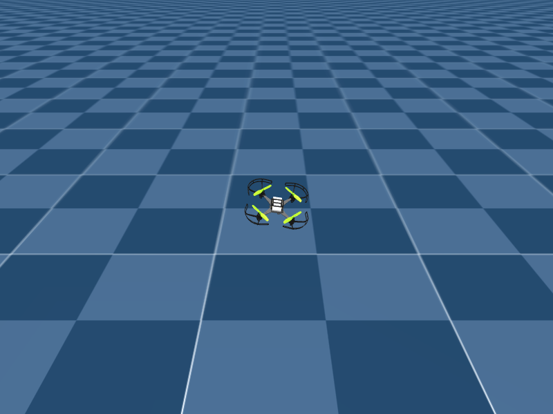

### 2.3 Step、局部 reset 和读取状态

```python
import jax.numpy as jnp
import numpy as np
from crazyflow.control import Control
from crazyflow.sim import Sim

sim = Sim(n_worlds=4, n_drones=3, control=Control.state, device="gpu")
sim.reset()
cmd = np.zeros((4, 3, 16), np.float32)
cmd[..., 12] = 1.0
cmd[..., 2] = 0.5
sim.state_control(cmd)
sim.step(50)

# 只重置 world 0 和 2；另外两个 world 连续运行
sim.reset(mask=jnp.array([True, False, True, False]))

pos = sim.data.states.pos          # (4, 3, 3)
pos_world0_drone1 = pos[0, 1]     # (3,)
```

## 3. Functional API 与 JAX 变换

OO 方法会修改 `sim.data`，不应直接放进 JAX 变换。Functional API 显式接收和返回 `SimData`。

| 函数 | 作用 |
|---|---|
| `F.state_control` | 暂存 16D state command，含有效 `xyzw` 四元数 |
| `F.attitude_control` | 暂存 4D attitude command |
| `F.body_rate_control` | 暂存 4D body rate command |
| `F.force_torque_control` | 暂存 4D force/torque command |
| `F.rotor_vel_control` | 暂存 4 路 RPM |
| `F.controllable` | 返回当前可触发控制更新的 world mask |
| `sim.build_step_fn()` | 构造 `(data, n_steps) -> data` 的 JIT 函数 |
| `sim.build_reset_fn()` | 构造 `(data, default_data, mask) -> data` 的 JIT 函数 |

### 3.1 JIT 编译 rollout

```python
import jax
import jax.numpy as jnp
import crazyflow.sim.functional as F
from crazyflow.control import Control
from crazyflow.sim import Sim

sim = Sim(n_worlds=1, n_drones=1, control=Control.attitude, device="gpu")
sim.reset()
data, default_data = sim.data, sim.default_data
step, reset = sim.build_step_fn(), sim.build_reset_fn()

cmd = jnp.zeros((1, 1, 4), dtype=jnp.float32)
cmd = cmd.at[..., 3].set(float(data.params.mass[0]) * 9.81)

@jax.jit
def rollout(data, default_data, cmd):
    data = reset(data, default_data)
    data = F.attitude_control(data, cmd)
    return step(data, 100)

data = rollout(data, default_data, cmd)
print(data.states.pos.shape, data.states.pos.device)  # (1, 1, 3), cuda:0
```

### 3.2 对完整动力学求梯度

```python
import jax
import jax.numpy as jnp
from crazyflow.control import Control
from crazyflow.sim import Sim

sim = Sim(control=Control.attitude, attitude_freq=50, device="gpu")
sim.reset()
data = sim.data.replace(
    states=sim.data.states.replace(pos=sim.data.states.pos.at[..., 2].set(0.5))
)
step = sim.build_step_fn()

def loss(cmd, data):
    data = data.replace(
        controls=data.controls.replace(
            attitude=data.controls.attitude.replace(staged_cmd=cmd)
        )
    )
    data = step(data, 10)
    return (data.states.pos[0, 0, 2] - 1.0) ** 2

grad_fn = jax.jit(jax.grad(loss))
cmd = jnp.zeros((1, 1, 4), dtype=jnp.float32)
cmd = cmd.at[..., 3].set(data.params.mass[0] * 9.81 * 1.05)
grad = grad_fn(cmd, data)
```

2026 年 8 月 `examples/jax/gradient.py` 历史实测：10 次梯度更新耗时 `3.76e-4 s`，平均 `3.76e-5 s/step`；最终 loss 为 `0.25175005`，推力梯度为 `-4.1913e-5`。当前模型已有参数、方程和饱和处理更新，需要重新运行才能比较。

### 3.3 持久 JAX 编译缓存

```python
from crazyflow.utils import enable_cache

enable_cache()  # 默认 /tmp/jax_cache-<uid>
```

运行 [`examples/jax/cache.py`](examples/jax/cache.py) 会交替创建和删除示例缓存。第三次有缓存运行的实测初始化/首步为 `0.538 s / 0.235 s`；无缓存运行为 `0.815 s / 0.368 s`。实际收益取决于函数是否达到持久缓存阈值和其他 XLA 缓存是否已预热。

## 4. 动力学库

### 4.1 模型选择与控制兼容性

```python
from crazyflow.sim import Dynamics, Sim

sim = Sim(dynamics=Dynamics.so_rpy_rotor_drag, control="attitude", device="gpu")
```

| 动力学 | 输入 | 转子动态 | 阻力 | state / attitude | force-torque / RPM |
|---|---|---:|---:|---:|---:|
| `first_principles` | 4 路 RPM | ✓ | ✓ | ✓ | ✓ |
| `so_rpy` | RPY + thrust | — | — | ✓ | — |
| `so_rpy_rotor` | RPY + thrust | ✓ | — | ✓ | — |
| `so_rpy_rotor_drag` | RPY + thrust | ✓ | ✓ | ✓ | — |

`Dynamics.default` 是 `first_principles`。body rate、force/torque 或 rotor velocity 配合拟合模型会在构造时抛出 `ConfigError`。

### 4.2 独立调用动力学函数

```python
import numpy as np
from crazyflow.dynamics import parametrize
from crazyflow.dynamics.first_principles import dynamics

fn = parametrize(dynamics, drone="cf2x_L250")
pos = vel = ang_vel = np.zeros(3)
quat = np.array([0.0, 0.0, 0.0, 1.0])
cmd = np.full(4, 15_000.0)
rotor_vel = np.full(4, 12_000.0)

pos_dot, quat_dot, vel_dot, ang_vel_dot, rotor_vel_dot = fn(
    pos, quat, vel, ang_vel, cmd, rotor_vel
)
```

拟合动力学的命令是 `[roll, pitch, yaw, thrust_N]`：

```python
from crazyflow.dynamics import parametrize
from crazyflow.dynamics.so_rpy_rotor_drag import dynamics

fn = parametrize(dynamics, "cf2x_L250")
cmd = np.array([0.0, 0.0, 0.0, 0.31])
thrust_state = np.full(4, 0.31)
derivatives = fn(pos, quat, vel, ang_vel, cmd, thrust_state)
```

四种模型都接受可选的世界坐标外力 `dist_f` 和世界坐标外力矩 `dist_t`。`so_rpy` 没有 rotor state，因此只返回 4 项导数。可查询特性：

```python
from crazyflow.dynamics import dynamics_features
from crazyflow.dynamics.first_principles import dynamics as fp
from crazyflow.dynamics.so_rpy import dynamics as srpy

print(dynamics_features(fp))    # {'rotor_dynamics': True}
print(dynamics_features(srpy))  # {'rotor_dynamics': False}
```

### 4.3 参数加载、覆盖与后端

```python
from crazyflow.dynamics import Dynamics, available_dynamics, load_fn_params, load_params, parametrize

raw = load_params(Dynamics.first_principles, "cf2x_L250")
print(raw["mass"])  # 物理和当前模型参数合并后的值
fn_params = load_fn_params(available_dynamics[Dynamics.first_principles], "cf2x_L250")

fn = parametrize(available_dynamics["first_principles"], "cf2x_L250")
result = fn(pos, quat, vel, ang_vel, cmd, rotor_vel, mass=0.0419)  # 只覆盖本次调用
fn.keywords["mass"] = np.float64(0.040)                           # 持久覆盖
```

`load_params(model, drone)` 返回模型的全部参数（包括 simulator 使用的推力上限）；
`load_fn_params(fn, drone)` 按函数签名筛选可传入的参数。全局参数在
`crazyflow/dynamics/params.toml`，机型参数在 `crazyflow/dynamics/<model>/params.toml`，
控制器参数在 `crazyflow/control/mellinger/params.toml`；`crazyflow.drones.load_params` 已移除。
用 `supported_dynamics(drone)` / `supported_drones(model)` 查询支持组合，例见第 15.3 节。

JAX 参数可直接放到 GPU：

```python
import jax
import jax.numpy as jnp
from crazyflow.dynamics import parametrize
from crazyflow.dynamics.first_principles import dynamics

fn = parametrize(dynamics, "cf2x_L250", xp=jnp, device=jax.devices("gpu")[0])
```

PyTorch CUDA 调用还应设置默认设备，因为函数内部会创建临时标量：

```python
import torch
from crazyflow.dynamics import parametrize
from crazyflow.dynamics.first_principles import dynamics

torch.set_default_device("cuda")
fn = parametrize(dynamics, "cf2x_L250", xp=torch, device="cuda")
out = fn(
    torch.zeros(3),
    torch.tensor([0.0, 0.0, 0.0, 1.0]),
    torch.zeros(3),
    torch.zeros(3),
    torch.full((4,), 15_000.0),
    torch.full((4,), 12_000.0),
)
assert all(x.device.type == "cuda" for x in out)
```

### 4.4 批处理与 domain randomization

动力学对任意前导维广播，不需要额外 batch 参数：

```python
import jax.numpy as jnp
from crazyflow.dynamics import parametrize
from crazyflow.dynamics.first_principles import dynamics

fn = parametrize(dynamics, "cf2x_L250", xp=jnp)
pos = jnp.zeros((50, 20, 3))
quat = jnp.broadcast_to(jnp.array([0.0, 0.0, 0.0, 1.0]), (50, 20, 4))
vel = ang_vel = jnp.zeros((50, 20, 3))
cmd = rotor_vel = jnp.full((50, 20, 4), 15_000.0)
vel_dot = fn(pos, quat, vel, ang_vel, cmd, rotor_vel)[2]
assert vel_dot.shape == (50, 20, 3)
```

JIT 下随机化参数的推荐方式是把 `mass`、`J`、`J_inv` 作为运行时 keyword argument 传入，避免每次随机化都重新编译：

```python
import jax

@jax.jit
def randomized_dynamics(pos, quat, vel, ang_vel, cmd, rotor_vel, mass, J, J_inv):
    return fn(
        pos, quat, vel, ang_vel, cmd, rotor_vel,
        mass=mass, J=J, J_inv=J_inv,
    )
```

### 4.5 CasADi 符号动力学

每种动力学都提供 `symbolic_dynamics`；拟合模型还提供原生 Euler 状态的 `symbolic_dynamics_euler`。

```python
import casadi as cs
from crazyflow.dynamics import parametrize
from crazyflow.dynamics.first_principles import symbolic_dynamics

symbolic = parametrize(symbolic_dynamics, "cf2x_L250")
X_dot, X, U, Y = symbolic(
    model_rotor_vel=True,
    model_dist_f=False,
    model_dist_t=False,
)
f = cs.Function("f", [X, U], [X_dot])
```

First-principles 且建模 rotor velocity 时，`X` 为 17D：`pos(3), quat(4), vel(3), ang_vel(3), rotor_vel(4)`。同时打开 `model_dist_f` 和 `model_dist_t` 后为 23D。

```python
from crazyflow.dynamics.so_rpy_rotor_drag import symbolic_dynamics_euler

symbolic_euler = parametrize(symbolic_dynamics_euler, "cf2x_L250")
X_dot, X, U, Y = symbolic_euler(model_rotor_vel=True)
```

Euler 版本状态为 `pos(3), rpy(3), vel(3), drpy(3), thrust_state(4)`，共 16D；当前 Docker 校验
`X_dot/X/U/Y` 为 `(16,1)/(16,1)/(4,1)/(6,1)`。只有第一项 thrust state 进入动力学。
[`examples/symbolic.py`](examples/symbolic.py) 还用 `cs.integrator("fd", "cvodes", ...)` 完成离散积分；
8 月旧接口保存的 `(13,1)/(13,1)/(4,1)/(7,1)` 输出保留为历史记录，不能作为当前 shape。

### 4.6 系统辨识

输入 flight log 至少包含：

| key | shape | 含义 |
|---|---:|---|
| `time` | `(N,)` | 时间戳，s |
| `pos` | `(N,3)` | 世界坐标位置，m |
| `quat` | `(N,4)` | `xyzw` |
| `cmd_rpy` | `(N,3)` | RPY 命令，rad |
| `cmd_f` | `(N,)` | 总推力命令，N |

这不是 reinforcement learning：没有 state/action/reward，而是带 JAX analytic Jacobian 的
SciPy trust-region least squares。translation 用记录的 `quat、vel、cmd_f、time` rollout 模型，
最小化观测加速度与预测加速度的残差；rotation 用 `cmd_rpy、time` rollout 二阶姿态模型，最小化
观测 RPY 与预测 RPY 的逐样本残差。

| 拟合器 | 待估参数 | 训练目标 | 返回/报告 |
|---|---|---|---|
| `sys_id_translation("so_rpy")` | `cmd_f_coef` | 加速度 residual sum of squares | 参数、RMSE、R² |
| `sys_id_translation("so_rpy_rotor")` | 上项 + `thrust_dyn_coef` | 同上，同时 rollout 推力动态 | 参数、RMSE、R² |
| `sys_id_translation("so_rpy_rotor_drag")` | 上项 + `drag_xy_coef, drag_z_coef` | 同上，同时拟合阻力 | 参数、RMSE、R² |
| `sys_id_rotation` | roll/pitch 共用与 yaw 独立的 `rpy`、`rpy_rates`、`cmd_rpy` 系数 | RPY residual sum of squares | 三组系数、RMSE、R² |

`derivatives_svf` 先用 state-variable filter 从 flight log 构造平滑速度、加速度和姿态信号。训练集
决定参数，`data_validation` 只负责判断泛化，不能把同一轨迹同时当训练和验证数据。

```python
from crazyflow.dynamics.utils.data_utils import derivatives_svf, preprocessing
from crazyflow.dynamics.utils.identification import sys_id_rotation, sys_id_translation

data = preprocessing(raw_flight_log)
data = derivatives_svf(data)
validation_data = preprocessing(raw_validation_flight_log)
validation_data = derivatives_svf(validation_data)

trans_params = sys_id_translation(
    dynamics="so_rpy_rotor_drag",
    mass=0.0319,
    data=data,
    data_validation=validation_data,  # 可选；应使用独立飞行轨迹
    verbose=0,
    plot=True,
)
rot_params = sys_id_rotation(
    data=data,
    data_validation=validation_data,
    verbose=0,
    plot=True,
)
```

成功运行会记录 `Training success=True`，随后分别打印 training/validation 的 RMSE 和 R²，并
返回可以传给拟合动力学的参数字典。`plot=True` 会画出 measured/predicted acceleration 或 RPY；
训练 R² 高而 validation R² 低通常表示轨迹激励不足或过拟合，而不是继续降低 optimizer tolerance
就能解决。

完整合成数据流水线已对 `so_rpy`、`so_rpy_rotor`、`so_rpy_rotor_drag` 和旋转辨识逐一执行。下图仅用于证明绘图/API 链路；合成的周期信号不是可靠 flight log，因此图中低 R² 不代表辨识器精度。实际使用应以独立真实轨迹做 validation。

上述完整流水线和图片是 8 月记录。当前旋转辨识直接使用 Euler 动力学，并修复无 validation
数据时的绘图；拟合推力参数 `thrust_dyn_coef` 的单位是 `1/s`，由旧 `thrust_time_coef` 的
时间常数取倒数，迁移自定义参数文件时应转换值。当前模型的 `acc_coef` 是 N 单位的推力偏置。

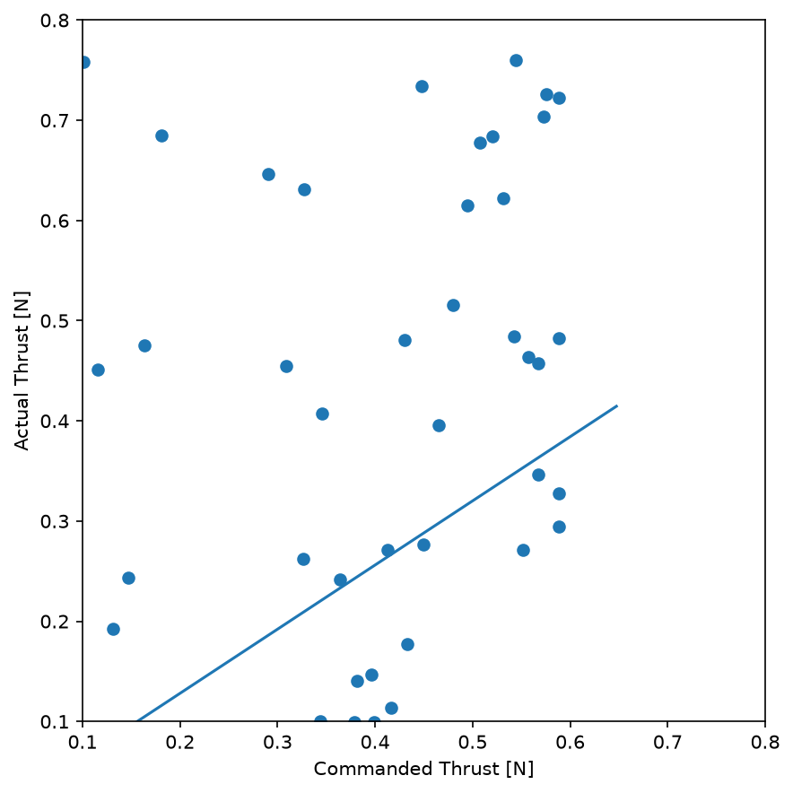

## 5. 控制器库

Mellinger 控制链是三个纯函数：

```text
state2attitude -> attitude2force_torque -> force_torque2rotor_vel
```

### 5.1 State → attitude

```python
import numpy as np
from crazyflow.control import parametrize
from crazyflow.control.mellinger import state2attitude

ctrl = parametrize(state2attitude, "cf2x_L250")
pos = vel = np.zeros(3)
quat = np.array([0.0, 0.0, 0.0, 1.0])
cmd = np.zeros(16)
cmd[12] = 1.0
cmd[:3] = [0.0, 0.0, 1.0]
rpyt, pos_err_i = ctrl(pos, quat, vel, cmd)
assert rpyt.shape == (4,) and pos_err_i.shape == (3,)
```

### 5.2 Attitude → force/torque

```python
from crazyflow.control.mellinger import attitude2force_torque

ctrl = parametrize(attitude2force_torque, "cf2x_L250")
force, torque, r_int_error = ctrl(
    quat,
    np.zeros(3),
    np.array([0.0, 0.0, 0.0, 0.3]),
)
assert force.shape == (1,) and torque.shape == (3,)
```

### 5.3 Force/torque → RPM

```python
from crazyflow.control.mellinger import force_torque2rotor_vel

ctrl = parametrize(force_torque2rotor_vel, "cf2x_L250")
rpm = ctrl(np.array([0.2]), np.zeros(3))
assert rpm.shape == (4,)
```

### 5.4 积分误差、参数化、批处理与 JIT

控制器无隐藏状态。需要把 `pos_err_i` 和 `r_int_error` 显式传到下一次调用：

```python
state_ctrl = parametrize(state2attitude, "cf2x_L250")
pos_err_i = np.zeros(3)
for _ in range(10):
    rpyt, pos_err_i = state_ctrl(pos, quat, vel, cmd, pos_err_i=pos_err_i)
```

在 `jax.jit` 下从第一次调用就传零数组，避免 `None → Array` 改变参数树而重复编译：

```python
import jax
import jax.numpy as jnp
from crazyflow.control import parametrize
from crazyflow.control.mellinger import state2attitude

ctrl = jax.jit(parametrize(state2attitude, "cf2x_L250", xp=jnp))
rpyt, err = ctrl(
    jnp.zeros((1000, 3)),
    jnp.broadcast_to(jnp.array([0.0, 0.0, 0.0, 1.0]), (1000, 4)),
    jnp.zeros((1000, 3)),
    jnp.zeros((1000, 16)).at[..., 12].set(1.0),
    pos_err_i=jnp.zeros((1000, 3)),
)
assert rpyt.shape == (1000, 4)
```

参数加载和单次/持久覆盖方式与动力学一致：

```python
from crazyflow.control import load_fn_params, load_params, parametrize
from crazyflow.control.mellinger import state2attitude

params = load_fn_params(state2attitude, "cf2x_L250")
sections = load_params("mellinger", "cf2x_L250")  # core + 各函数的嵌套参数表
ctrl = parametrize(state2attitude, "cf2x_L250")
rpyt, _ = ctrl(pos, quat, vel, cmd, mass=0.035)  # 单次覆盖
ctrl.keywords["mass"] = np.float64(0.035)       # 持久覆盖
```

## 6. Step/reset pipelines 与插件

`step_pipeline` 和 `reset_pipeline` 都是有名字且顺序固定的纯函数字典。默认 first-principles + attitude 的 step stages 为：

```python
from crazyflow.sim import Sim

sim = Sim()
print(tuple(sim.step_pipeline))
# ('attitude_controller', 'force_torque_controller', 'clip_rotor_vel_cmd',
#  'integration', 'clip_floor_pos', 'increment_steps')
```

Pipeline 操作 API：

| 函数 | 作用 |
|---|---|
| `append_fn` / `prepend_fn` | 追加/前置 stage |
| `insert_fn_before` / `insert_fn_after` | 相对某个命名 stage 插入 |
| `replace_fn` | 替换命名 stage |
| `remove_fn` | 删除命名 stage |

修改后必须调用对应的 `build_step_fn()` 或 `build_reset_fn()` 重新编译。

### 6.1 扰动注入

```python
import jax
from crazyflow.sim import Sim
from crazyflow.sim.data import SimData
from crazyflow.sim.pipeline import insert_fn_before

def disturbance(data: SimData) -> SimData:
    key, subkey = jax.random.split(data.core.rng_key)
    force = jax.random.normal(subkey, data.states.force.shape) * 0.2
    return data.replace(
        states=data.states.replace(force=force),
        core=data.core.replace(rng_key=key),
    )

sim = Sim(control="state", device="gpu")
insert_fn_before(sim.step_pipeline, "integration", disturbance)
sim.build_step_fn()
```

原版 [`examples/plugins/disturbance.py`](examples/plugins/disturbance.py) 的 3 秒对照 rollout 如下，虚线为每个动力学 tick 注入随机力和力矩后的结果：

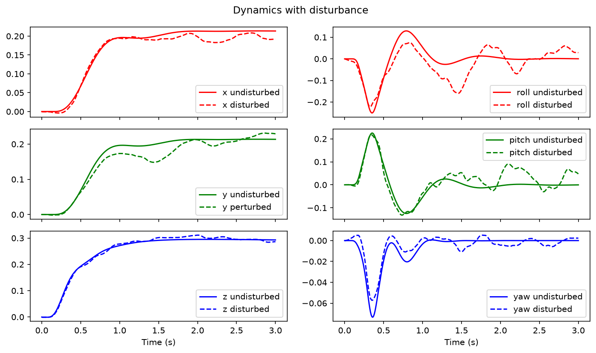

### 6.2 Reset randomization 与 mask

```python
import jax
from jax import Array
from crazyflow.sim import Sim
from crazyflow.sim.data import SimData
from crazyflow.sim.pipeline import append_fn
from crazyflow.utils import leaf_replace

def randomize_mass(data: SimData, default_data: SimData, mask: Array | None) -> SimData:
    key, subkey = jax.random.split(data.core.rng_key)
    shape = (data.core.n_worlds, data.core.n_drones, 1)
    scale = jax.random.uniform(subkey, shape, minval=0.9, maxval=1.1)
    mass = default_data.params.mass * scale
    return data.replace(
        params=leaf_replace(data.params, mask, mass=mass),
        core=data.core.replace(rng_key=key),
    )

sim = Sim(n_worlds=16, device="gpu")
append_fn(sim.reset_pipeline, randomize_mass)
sim.build_reset_fn()
sim.reset()  # 全部 world
sim.reset(mask=jax.numpy.array([True] + [False] * 15))
```

Reset stage 的签名必须是 `(data, default_data, mask) -> data`。使用 `default_data` 作随机化
基准可避免连续 reset 累乘漂移，使用 `leaf_replace` 才能正确遵守局部 reset mask。
首次随机化把共享参数扩展为 world/drone 数组时会重编译；当前还支持每电机的推力曲线、
力矩曲线、转子动态、臂长和桨叶惯量，形状及实验方法见第 15.5 节。

### 6.3 自定义 plugin state：动作延迟

插件状态保存在 `data.plugins` 中，并在 `build_default_data()` 后跨 reset 保留：

```python
import jax.numpy as jnp
from crazyflow.sim import Sim
from crazyflow.sim.data import SimData
from crazyflow.sim.pipeline import prepend_fn

def action_delay(data: SimData) -> SimData:
    queue = data.plugins["queued_actions"]
    next_action = queue[0]
    queue = jnp.roll(queue, shift=-1, axis=0)
    queue = queue.at[-1].set(data.controls.attitude.staged_cmd)
    attitude = data.controls.attitude.replace(staged_cmd=next_action)
    return data.replace(
        controls=data.controls.replace(attitude=attitude),
        plugins=data.plugins | {"queued_actions": queue},
    )

sim = Sim(control="state", device="gpu")
delay_steps = int(0.03 * sim.data.controls.attitude.freq)
sim.data = sim.data.replace(
    plugins=sim.data.plugins | {
        "queued_actions": jnp.zeros((delay_steps, 1, 1, 4))
    }
)
prepend_fn(sim.step_pipeline, action_delay, name="action_delay")
sim.build_default_data()
sim.build_step_fn()
```

这段与上游单 world 演示一致，裸数组没有 world-axis 元数据，因此 masked reset 不会重置队列，
sharding 会复制整个队列。多 world 队列应改用带 `CORE_NDIM_KEY` 的 flax struct，并把 world
放在第一轴，见第 15.4 节。2026 年 8 月
[`examples/plugins/action_delay.py`](examples/plugins/action_delay.py) 历史实测 30 ms attitude delay
使两条轨迹的平均位置差为 `27.93 cm`。

### 6.4 UWB 状态估计插件

[`examples/plugins/estimation.py`](examples/plugins/estimation.py) 演示了完整的 pipeline 组合：

1. `simulate_uwb` 在 pipeline 开头生成 8 基站测距。
2. `estimate_state` 用 constant-velocity EKF 更新位置/速度和 covariance。
3. `use_estimate_for_control` 临时把估计状态暴露给控制器。
4. `restore_ground_truth` 在积分前恢复真实物理状态。

2026 年 8 月 20 秒完整 rollout 的历史结果：

| 测量 | Tracking RMS | Estimation RMS |
|---|---:|---:|
| 理想 UWB | 0.083 m | 0.001 m |
| 3 cm 噪声 + 最大 8 cm bias | 0.770 m | 0.028 m |

## 7. MuJoCo / MJX 集成

Crazyflow 的动力学由 JAX 计算；MuJoCo/MJX 负责场景、相机、光照、碰撞和可视化。

| 对象 | 用途 |
|---|---|
| `sim.spec` | 可编辑的 `mujoco.MjSpec` 场景 |
| `sim.mj_model`, `sim.mj_data` | CPU MuJoCo 模型和渲染 buffer |
| `sim.mjx_model`, `sim.mjx_data` | JAX/MJX 场景和 world batch |

### 7.1 Fused drone mesh

```python
sim = Sim(n_worlds=1, n_drones=17, fused_mjx_model=True)
```

`fused_mjx_model=True` 把分离的 PCB、电机、桨叶、LED 和电池视觉 mesh 合并，减少大规模 swarm 的 MuJoCo/MJX 内存；只改变视觉细节，不改变动力学。

### 7.2 运行时挂载 MJCF 对象

```python
import mujoco
from crazyflow.sim import Sim

sim = Sim(device="gpu")
obstacle_spec = mujoco.MjSpec.from_string("""
<mujoco>
  <worldbody>
    <body name="obstacle">
      <geom type="box" size="0.1 0.1 0.1" rgba="0.9 0.15 0.1 1"/>
    </body>
  </worldbody>
</mujoco>
""")

frame = sim.spec.worldbody.add_frame()
for i, pos in enumerate(([0.3, -0.18, 0.25], [0.3, 0.18, 0.55])):
    body = obstacle_spec.body("obstacle")
    attached = frame.attach_body(body, "", f":{i}")
    attached.pos = pos

sim.build_mjx()
sim.reset()
```

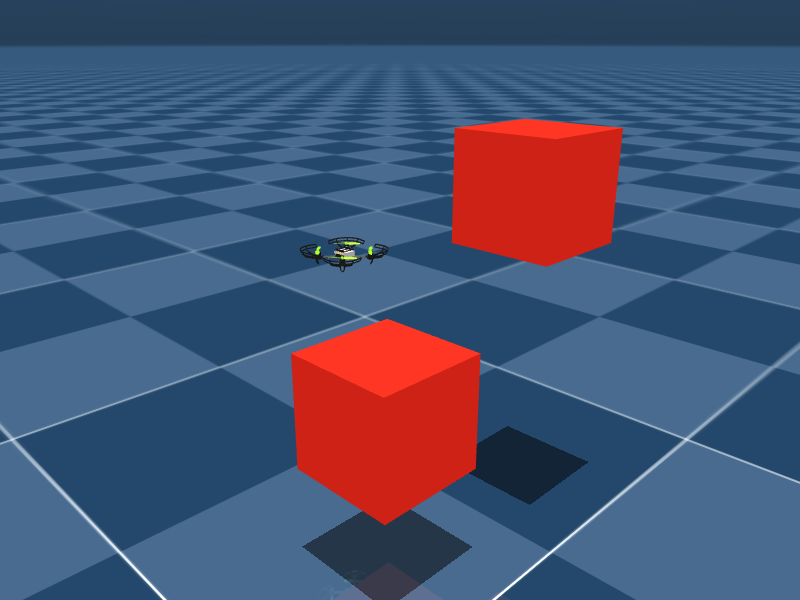

从文件读取时使用 `mujoco.MjSpec.from_file(path)`。需要运行时移动对象时，把 body 设为 mocap，再更新 `sim.mjx_data.mocap_pos` / `mocap_quat`。

### 7.3 同步和 contacts

`sim.step()` / `sim.reset()` 只更新 JAX state，并把 `mjx_synced` 设为 false。第一次 `sim.render()` 或 `sim.contacts()` 会执行位置/四元数同步、kinematics、camlight 和 collision；同一 tick 中的后续查询复用结果：

```python
sim.step(5)
contacts = sim.contacts()                 # 在这里同步一次
rgb = sim.render(mode="rgb_array")       # 复用已同步的 MJX data
```

紧循环里不要把整个 `mjx_data` 当作动态 JIT 参数；可以闭包捕获它，只把小型 `SimData` 与 obstacle position 作为输入。

### 7.4 Sphere/box collision

```python
from crazyflow.sim.sim import use_box_collision

use_box_collision(sim, enable=True)
contacts = sim.contacts()  # (n_worlds, n_contact_slots) bool
```

默认 sphere 适合快速保守检查；oriented box 更贴合机身，适合窄通道和碰撞调试。交互式 `contacts.py` 已完整渲染 120 帧并检查 `sim.contacts()`：

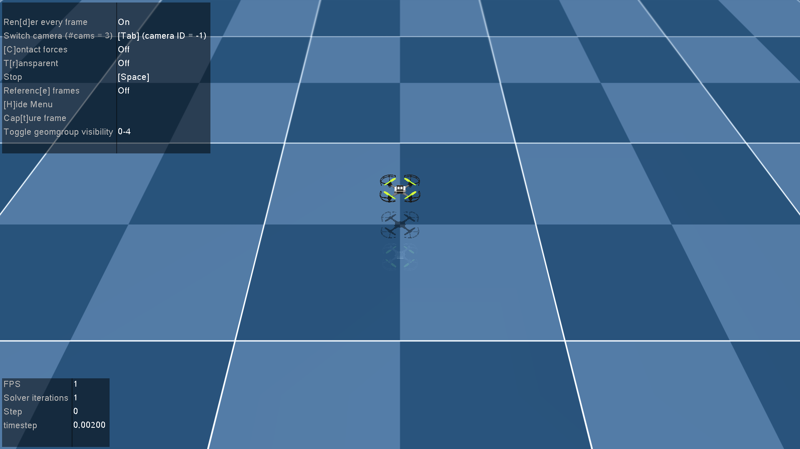

## 8. MuJoCo 可视化、相机、材质与 raycasting

### 8.1 Render modes

| mode | 返回值 |
|---|---|
| `human` | X11 交互窗口，返回 `None` |
| `rgb_array` | `(H,W,3) uint8` |
| `depth_array` | `(H,W) float32` |
| `rgbd_tuple` | `(rgb, depth)` |

```python
rgb = sim.render(mode="rgb_array", camera="fpv_cam:0", width=320, height=240)
sim.close()
depth = sim.render(mode="depth_array", camera=0, width=320, height=240)
sim.close()
rgb, depth = sim.render(mode="rgbd_tuple", camera="track_cam:0", width=160, height=120)
sim.close()
```

重要：同一个 `Sim` 会缓存第一次创建的 renderer、相机和尺寸。若要切换 camera、mode 对应的离屏配置或分辨率，应先 `sim.close()` 再 render。`world=3` 可选择第 4 个并行 world；一次只渲染一个 world。

FPV 相机跟随机体。原版 [`examples/rendering/cameras.py`](examples/rendering/cameras.py) 完整保存 250 帧 RGB-D，实测平均 render time `8.02 ms`，约 `124.64 fps`：

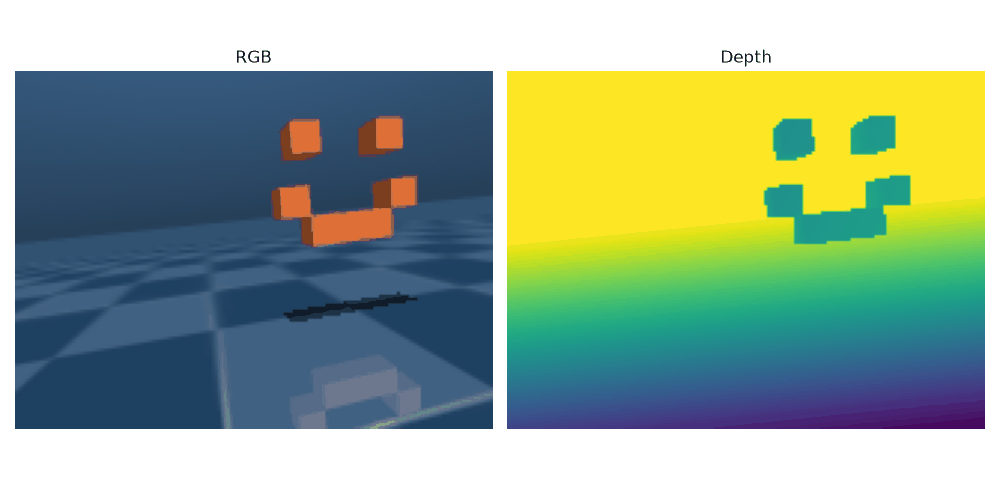

### 8.2 Human viewer 和 camera config

```python
sim.render(
    mode="human",
    camera="track_cam:0",
    cam_config={
        "distance": 3.0,
        "elevation": -45.0,
        "azimuth": 90.0,
        "lookat": [0.0, 0.0, 1.0],
    },
)
```

容器验证的 OpenGL renderer 为 NVIDIA RTX 4070 Ti SUPER，OpenGL 4.6，direct rendering 开启。

### 8.3 动态材质

```python
import numpy as np
from crazyflow.sim.visualize import change_material

ids = np.arange(sim.n_drones)
rgba = np.random.default_rng(0).uniform(0, 1, (sim.n_drones, 4))
rgba[:, 3] = 1.0
change_material(sim, "led_top", ids, rgba=rgba, emission=1.0)
change_material(sim, "led_bot", ids, rgba=rgba[::-1], emission=0.8)
```

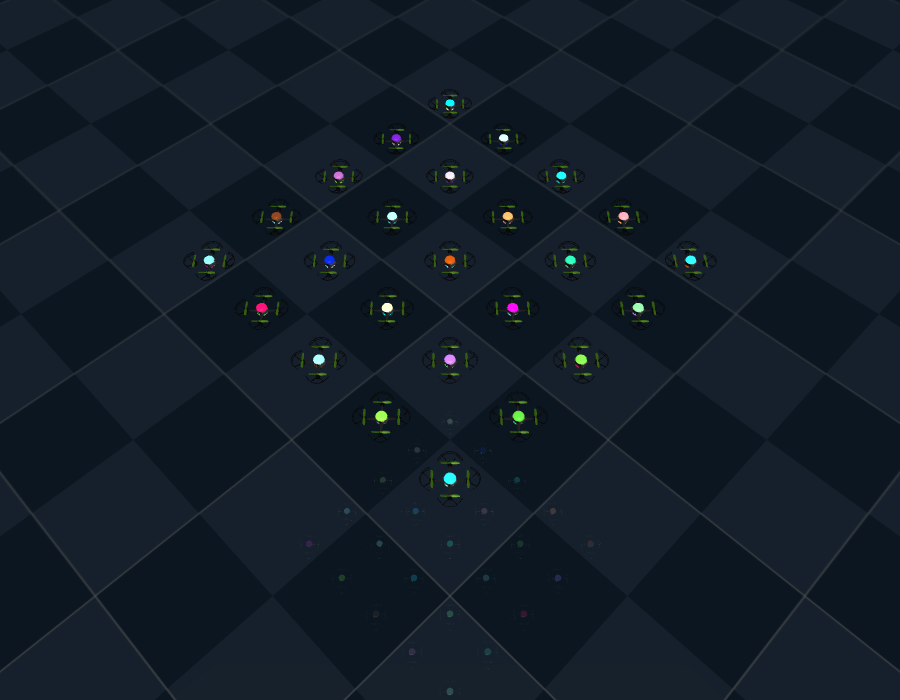

### 8.4 Raycasting depth

```python
from crazyflow.sim.sensors.depth import build_render_depth_fn, render_depth

depth = render_depth(sim, camera=0, resolution=(100, 100), include_drone=False)

render_depth_compiled = build_render_depth_fn(
    sim.mjx_model,
    camera=0,
    resolution=(200, 200),
    geomgroup=(1, 1, 0, 1, 1, 1, 1, 1),
)
depth_fast = render_depth_compiled(sim)
```

返回 shape 为 `(n_worlds, H, W)`。实测 100×100 和编译后的 200×200 路径分别得到 6,390 与 26,816 个小于 1.5 m 的有效 ray：

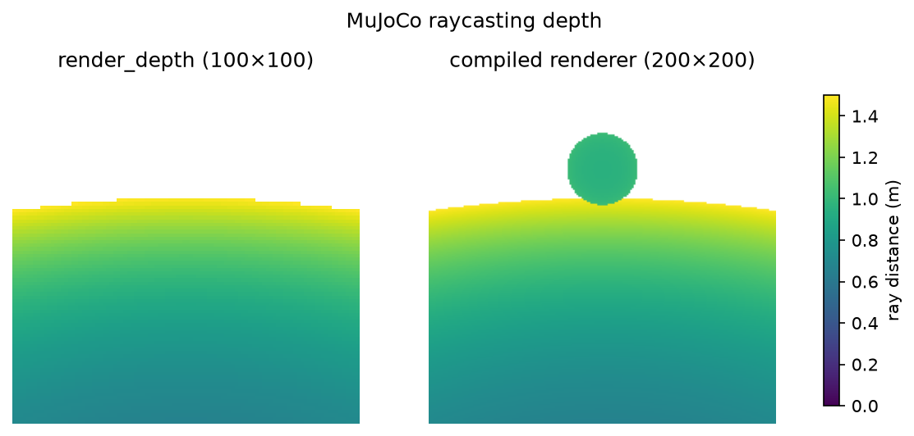

## 9. Gaussian Splat Rendering

容器已经包含 `crazyflow[splats]`、splax viewer 和 CUDA rasterizer。独立安装可用：

```bash
pip install "crazyflow[splats]"
```

Web viewer 可在任意设备显示；splat camera sensor 必须使用 NVIDIA GPU。

本节图片和像素/深度范围保留自 8 月 CUDA 验证。当前 splat 插件改为 flax `SplatData`，
颜色使用球谐系数 `sh_colors`（`N × K × 3`），不是旧字典中的 RGB；scene/drone 两份 PLY
必须具有相同的球谐阶数。若自行读写 splat 数据，使用
`sim.data.plugins["splats"].replace(...)` / `.params`，不要再按旧字典键访问。

### 9.1 下载并挂载 splats

```python
from splax.io import fetch
from crazyflow.sim import Sim
from crazyflow.sim.splat import attach_splats

assets = "https://huggingface.co/datasets/amacati/splats/resolve/main"
scene = fetch(f"{assets}/robot_hall.ply")
drone = fetch(f"{assets}/cf2x_L250.ply")

sim = Sim(n_worlds=2, n_drones=2, control="state", device="gpu")
attach_splats(sim, scene=scene, drone=drone)
```

资产首次下载到 `~/.cache/splax`，可用 `SPLAX_CACHE` 改位置。scene 与 MuJoCo world 坐标系对齐；drone splat 与机体系、质心对齐。挂载后的数组和每架 drone 的 buffer slice 存在 `sim.data.plugins`，会随 JIT data 和 reset 保留。

### 9.2 Batched RGB camera

```python
from crazyflow.sim.sensors.splat import build_render_splat_fn, render_splat_rgb

images = render_splat_rgb(sim, resolution=(320, 240))
assert images.shape == (2, 2, 240, 320, 3)

render_rgb = build_render_splat_fn(
    sim,
    resolution=(160, 120),
    exclude_self=True,
)
images = render_rgb(sim.data)  # 纯函数，可 JIT/grad
```

实测像素范围 `0.000117–0.999924`，四路 FPV 如下：

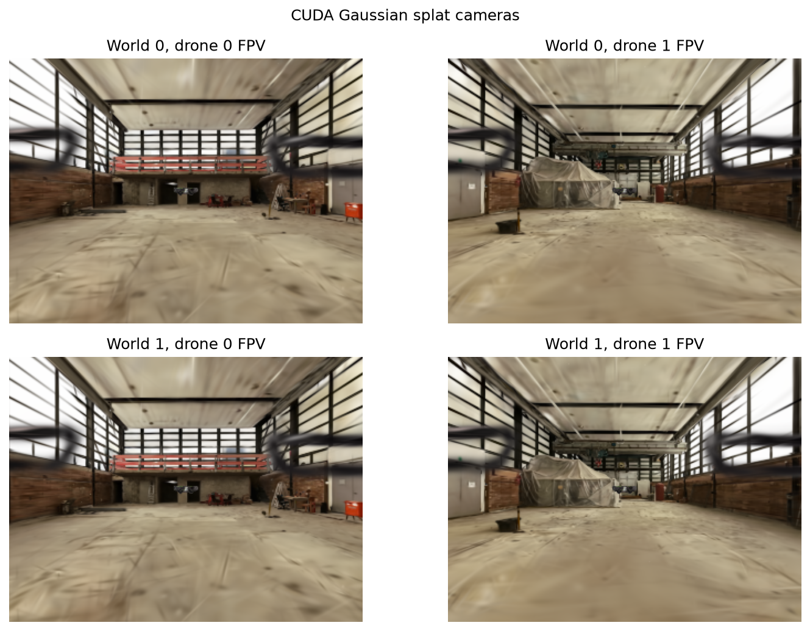

### 9.3 RGB-D camera

```python
from crazyflow.sim.sensors.splat import build_render_splat_rgbd_fn, render_splat_rgbd

rgbd = render_splat_rgbd(
    sim,
    drones=0,
    resolution=(320, 240),
    max_range=8.0,
)
assert rgbd.shape == (2, 1, 240, 320, 4)
rgb, depth = rgbd[..., :3], rgbd[..., 3]

render_rgbd = build_render_splat_rgbd_fn(
    sim,
    drones=0,
    resolution=(160, 120),
    max_range=8.0,
)
rgbd = render_rgbd(sim.data)
```

实测 depth 范围 `0.02172–8.0 m`。这里的 depth 是沿相机光轴的深度；MuJoCo `render_depth` 返回 ray distance，两者不能混用。

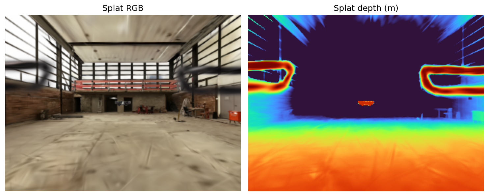

### 9.4 可微 splat 渲染

[`examples/rendering/splat_gradients.py`](examples/rendering/splat_gradients.py) 对 100 个 z offset 和 yaw angle 同时渲染，再对 photometric error 求梯度。实际曲线与已知 pose gradient 在零点、符号和整体形状上一致：

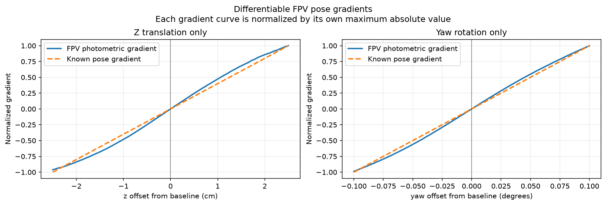

### 9.5 Web viewer

```python
from crazyflow.sim.splat import SplatViewer

viewer = SplatViewer(sim, port=8080)
for _ in range(500):
    sim.step(sim.freq // sim.control_freq)
    viewer.update(sim, world=0)
viewer.close()
```

访问 `http://localhost:8080`。实测 HTTP 与 WebSocket 均连接，scene tree 中出现 `/scene` 和 `/drone:0`：

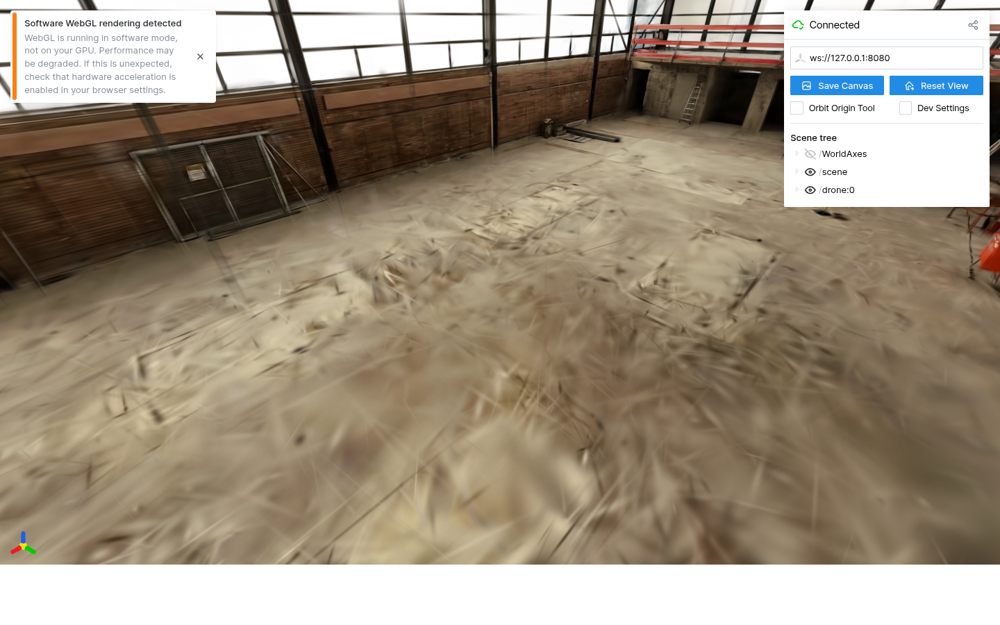

截图使用 headless Chrome software WebGL，所以页面左上角会显示 software WebGL 提示；viewer 的数据传输、scene tree 和画面均正常。普通桌面 Chrome 可启用硬件 WebGL。

## 10. Gymnasium 向量环境

### 10.1 环境列表

导入 `crazyflow` 或 `crazyflow.envs` 会注册：

| ID | 类 | 任务 |
|---|---|---|
| `DroneReachPos-v0` | `ReachPosEnv` | 到达目标位置 |
| `DroneReachVel-v0` | `ReachVelEnv` | 匹配目标速度 |
| `DroneLanding-v0` | `LandingEnv` | 安全降落 |
| `DroneFigureEightTrajectory-v0` | `FigureEightEnv` | 跟踪 figure-eight |

`DroneEnv` 是不提供具体 reward 的基类，不单独注册为 Gym ID。

### 10.2 JAX/CUDA 基本用法

```python
import gymnasium
import crazyflow.envs  # 注册环境

env = gymnasium.make_vec(
    "DroneFigureEightTrajectory-v0",
    num_envs=20,
    freq=50,
    n_samples=10,
    samples_dt=0.1,
    trajectory_time=10.0,
    device="gpu",
)
obs, info = env.reset(seed=0)
for _ in range(500):
    obs, reward, terminated, truncated, info = env.step(env.action_space.sample())
env.close()
```

2026 年 8 月四个 ID 均以 4 个 CUDA world 实际 reset/step，obs 与 reward 都留在 `cuda:0`。

公共构造参数：`num_envs`、`max_episode_time`、`dynamics`、`drone`、`freq`、`device`；基类还接受 `reset_randomization(data, default_data, mask)`。

### 10.3 Action normalization

```python
from crazyflow.envs import NormalizeActions

env = NormalizeActions(env)
action = env.action_space.sample()  # [-1, 1]^4
obs, reward, terminated, truncated, info = env.step(action)
```

### 10.4 NumPy 与 PyTorch adapter

需要传统 CPU/NumPy 训练器时：

```python
from gymnasium.wrappers.vector import JaxToNumpy

env = gymnasium.make_vec("DroneFigureEightTrajectory-v0", num_envs=16, device="cpu")
env = JaxToNumpy(NormalizeActions(env))
```

需要 GPU PyTorch 时保持数据在 GPU：

```python
import torch
from gymnasium.wrappers.vector import JaxToTorch

env = gymnasium.make_vec("DroneReachPos-v0", num_envs=16, device="gpu")
env = JaxToTorch(NormalizeActions(env), device=torch.device("cuda"))
obs, info = env.reset()
action = torch.zeros((16, 4), device="cuda")
obs, reward, terminated, truncated, info = env.step(action)
assert reward.device.type == "cuda"
```

不要把 GPU JAX env 包成 `JaxToNumpy` 后直接传 NumPy action：wrapper 输出在 CPU，而 `NormalizeActions` 的 scale 在 GPU，会造成跨设备 JIT 错误。CPU/NumPy 和 GPU/Torch 分别使用上面两种配对。

### 10.5 把环境看成 MDP：状态、动作与 episode

四个任务共享 13 维机体状态，再追加任务信息。训练器按下表顺序 flatten，顺序也会写入 checkpoint，
因此加载策略时不能自行交换字段。

| observation key | 维数 | 物理含义 | 使用任务 |
|---|---:|---|---|
| `pos` | 3 | 世界坐标位置 `[x,y,z]`，m | 全部 |
| `quat` | 4 | 机体姿态 `[x,y,z,w]` | 全部 |
| `vel` | 3 | 世界坐标线速度，m/s | 全部 |
| `ang_vel` | 3 | 机体坐标角速度，rad/s | 全部 |
| `difference_to_goal` | 3 | `goal_pos - pos`，m | ReachPos、Landing |
| `difference_to_target_vel` | 3 | `target_vel - vel`，m/s | ReachVel |
| `local_samples` | 30 | 未来 10 个轨迹点相对当前位置的 3D 向量 | Figure-eight |

所以 ReachPos、ReachVel、Landing 的策略输入均为 16D，Figure-eight 为 43D。observation 是
策略能看到的信息；reward 只用于训练，不会自动拼入 observation。

四个任务都使用 attitude action。`NormalizeActions` 让策略统一输出 `a ∈ [-1,1]^4`，再线性映射为：

| action index | 物理命令 | `cf2x_L250` 范围 |
|---:|---|---:|
| 0 | roll | `[-π/2, π/2] rad` |
| 1 | pitch | `[-π/2, π/2] rad` |
| 2 | yaw | `[-π/2, π/2] rad` |
| 3 | 四电机总推力 | `[0.05127, 0.48] N` |

映射公式是 `a_physical = clip(a,-1,1) × (high-low)/2 + (high+low)/2`。这里的第四维是
总推力，不是单电机 RPM；也不要把 action 顺序误写成 thrust-first。

训练配置采用 50 Hz 环境频率、10 秒 horizon，即每个 episode 500 个决策步。底层仿真为
500 Hz，所以一次 `env.step()` 内部推进 10 个动力学步。Gymnasium 使用 `NEXT_STEP` autoreset：
某一步返回 `terminated=True` 或 `truncated=True` 后，下一次 step 才重置对应 world。

| 任务 | reset 分布 | 任务目标 | terminated | truncated |
|---|---|---|---|---|
| ReachPos | `pos∈[-1,-1,1]..[1,1,2]`，`vel∈[-1,1]^3` | `goal∈[-1,-1,0.5]..[1,1,1.5]` | `z<0` | 10 s |
| ReachVel | 同上 | `target_vel∈[-1,1]^3 m/s` | `z<0` | 10 s |
| Landing | 同上 | 固定 `goal=[0,0,0.1] m` | `z<0` | 10 s |
| Figure-eight | `x/y∈[-0.1,0.1]`、`z∈[1.1,1.3]`、`vel∈[-0.5,0.5]^3` | `x=sin(t), y=0, z=0.5sin(2t)+1` | 触地或越出 `±[2,2,2] m` | 10 s |

### 10.6 每个任务究竟优化什么

记位置误差 `e_p = goal_pos - pos`，速度误差 `e_v = target_vel - vel`，速度大小为
`s = ||vel||₂`。环境每一步给出的原始 reward 为：

| 任务 | 非终止步 reward | 策略被鼓励做什么 |
|---|---|---|
| ReachPos | `exp(-2 ||e_p||₂)` | 尽快接近并停在随机目标位置 |
| ReachVel | `exp(-||e_v||₂)` | 让三维速度匹配目标速度 |
| Landing | `exp(-2 ||e_p||₂) × exp(-2s)` | 同时接近 10 cm 高目标并把速度降到零 |
| Figure-eight | `exp(-2 ||p_ref(t)-pos||₂)` | 跟踪当前 figure-eight 参考点 |

非终止 reward 的最大值是 1；一旦 terminated，当步 reward 直接变为 `-1`。ReachPos 和
Figure-eight 的 reward 不显式惩罚速度，Landing 则明确惩罚高速掠过目标。训练器记录的
`mean_reward` 就是上表的环境 reward；RMSE 和成功率是评估阶段额外计算的指标，不参与 PPO
reward。

评估运行 256 个环境、每个 500 步，默认用策略均值而不是随机采样。成功口径为：全程未
terminated，且最后 1 秒的每环境 RMSE 小于 `0.10 m`；ReachVel 单位改为 `m/s`；Figure-eight
阈值为 `0.15 m`；Landing 还要求最后 1 秒速度 RMSE 小于 `0.10 m/s`。因此“reward 上升”、
“误差收敛”和“整段 episode 不触地”是三个不同问题，结果表会分别报告。

### 10.7 四个 Gymnasium 任务的训练、评估与收敛结果（2026 年 8 月）

[`usage_assets/train_gymnasium.py`](usage_assets/train_gymnasium.py) 是四个任务共用的可复现
CUDA PPO 训练器。它不修改环境、reward 或 Crazyflow 核心源码：4096 个 JAX/CUDA 环境负责
仿真，PyTorch/CUDA 在同一张 GPU 上训练策略。训练器还显式播种仿真 RNG 和任务目标 RNG，
因此 `--seed` 能同时复现初始状态与目标。

#### 10.7.1 网络、PPO loss 与训练日志

actor 和 critic 是相互独立的两层 128-unit Tanh MLP。actor 输出 4 维 bounded mean，另有
4 个可学习 log standard deviation；采样动作探索用于训练，mean action 用于确定性评估。

每次 PPO update 先从 4096 个环境各收集 64 步，共 `262,144` transitions；随后分成 16 个
minibatch，每个 `16,384` transitions，最多重复优化 4 个 epoch。主要参数为：

| 参数 | 值 | 作用 |
|---|---:|---|
| optimizer | Adam，`eps=1e-5` | 同时更新 actor、critic 和 log standard deviation |
| learning rate | `3e-4 → 0` | 按 PPO update 线性退火 |
| `gamma` | 0.99 | 折扣未来 reward |
| `GAE lambda` | 0.95 | bias/variance 折中 |
| PPO clip | 0.2 | 限制单次策略比例变化 |
| entropy coefficient | 0.002 | 保留探索 |
| value coefficient | 0.5 | critic loss 权重 |
| gradient norm | 0.5 | 梯度裁剪 |
| target KL | 0.03 | 单个 update 过大时提前停止 epoch |

优化器最小化的实现形式可以概括为：

```text
L_total = L_PPO-clipped + 0.5 L_value - 0.002 H(policy) + λ_BC L_controller
```

Figure-eight 和 ReachVel 使用 `λ_BC=0`，即纯 PPO。ReachPos 和 Landing 先执行 1000 个
behavior-cloning batch；每个 batch 都让 4096 个环境按 teacher action 前进一步，然后最小化
actor mean 与 teacher action 的 MSE。其 teacher 是一个临界阻尼位置控制器：

```text
desired_acceleration = clip(4 × position_error - 4 × velocity, -4, 4)
```

训练器把期望加速度换算为 roll、pitch 和总推力。PPO fine-tune 阶段继续使用
`λ_BC=10` 的 controller anchor，以防 Landing 回到“安全悬停但不降落”的局部最优。teacher
只存在于 [`usage_assets/train_gymnasium.py`](usage_assets/train_gymnasium.py)，没有改变官方
observation、环境 reward 或 Crazyflow 源码。

训练时每行日志的含义：

| 日志字段 | 含义 | 怎样判断 |
|---|---|---|
| `steps` | 已采集的总 transitions | 最终值可能略小于请求值，因为只执行完整 PPO batch |
| `reward` | 当前 rollout 的平均环境 reward | 趋近 1 通常表示误差减小，但仍要看 survival |
| `distance` | 当前 rollout 的平均任务误差 | ReachVel 单位实际为 m/s，其余为 m |
| `episode` | 最近完成 episode 的平均 return | episode 尚未结束时显示 `nan` 是正常的 |
| `term` | rollout 中 terminated 比例 | 持续较高通常表示触地或越界 |
| `KL` / `clip` | 策略更新幅度及被 clip 样本比例 | 突然增大说明 update 过激 |
| `SPS` | 每秒处理 transitions | 用于确认并行/GPU 吞吐，不代表策略质量 |

Checkpoint 保存 `agent state_dict`、完整配置、observation 顺序和训练 history；默认放在 `saves/`。
结果图左侧是训练误差，中间是官方 reward，右侧是一个确定性评估 world。由于 `saves/` 不进入
Git，新 checkout 必须先运行相应训练命令；已有 checkpoint 则使用 `--eval-only`，不会继续更新权重。

#### 10.7.2 Figure-eight：为什么官网固定动作不跟踪

官网 [`examples/environments/figure8.py`](examples/environments/figure8.py) 使用固定 normalized thrust action
`0.3`，它只演示 vector environment 接口，并不是轨迹跟踪算法。固定动作不会利用 observation
中的未来轨迹点，因此不能用它判断环境是否可学习。

完整训练并评估：

```bash
python usage_assets/train_gymnasium.py \
  --num-envs 4096 \
  --num-steps 64 \
  --total-timesteps 20000000 \
  --eval-envs 256
```

只加载训练好的 `saves/figure8_ppo.pt` 重新评估和绘图：

```bash
python usage_assets/train_gymnasium.py --eval-only --eval-envs 256
```

训练命令会生成 `saves/figure8_ppo.pt`；`saves/` 是本地运行产物，不进入 Git 或 Docker build context。当前验证机器上已保留 checkpoint，新的 checkout 先运行上一条完整训练命令即可生成。

训练保持官方 43D observation（位置、四元数、速度、角速度和未来 10 个相对轨迹点）与原始距离 reward。

RTX 4070 Ti SUPER 上的实测结果：

| 项目 | 结果 |
|---|---:|
| 实际训练 transitions | 19,922,944 |
| PPO updates | 76 |
| 训练时间 | 18.65 s |
| 平均吞吐 | 1,068,368 transitions/s |
| 主评估 | 256 个随机初始状态，seed 7 |
| 平均 reward / step | 0.95688 |
| 平均 episode return（500 steps） | 478.44 |
| 平均位置误差 | 0.02298 m |
| 位置 RMSE | 0.03936 m |
| 95% 位置误差 | 0.07828 m |
| 最大位置误差（包含随机初始瞬间） | 0.33302 m |
| 未触地且末秒 RMSE < 15 cm | 100% |

在完全相同的 seed 7、256 个初始状态和 500-step horizon 下，固定推力与训练后策略的直接对比如下：

| 方法 | reward / step | 平均误差 | RMSE | 成功率 |
|---|---:|---:|---:|---:|
| 官网固定 normalized `thrust=0.3` 接口示例 | 0.29101 | 0.85704 m | 1.04915 m | 0% |
| CUDA PPO 确定性策略 | 0.95688 | 0.02298 m | 0.03936 m | 100% |

同一 checkpoint 又用 seed `7/42/43/123/2026` 各评估 256 个环境，共覆盖 1280 个随机初始状态；五组 RMSE 均在 `0.03872–0.04005 m`，成功率均为 100%。用最终脚本独立从零复训的 seed 7 和 seed 42 策略又分别达到 `0.04391 m` 和 `0.05013 m` RMSE，成功率均为 100%，说明结果可以复现而非单次偶然。

下图左、中分别是训练误差和官方原始 reward，右侧是随机初始状态下的一条确定性策略轨迹。
初始点由环境随机在 `x/y ±0.1 m、z 1.1–1.3 m` 中生成，所以开头需要先收敛到 reference；此后策略跟踪完整 figure-eight。

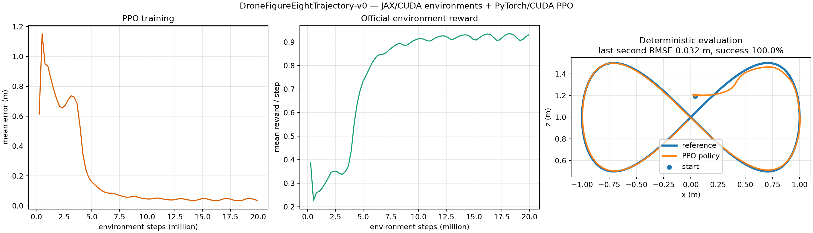

#### 10.7.3 ReachPos、ReachVel 与 Landing：运行命令和结果

其余三个注册任务也不能用随机动作或固定推力判断最终效果。下面分别给出可直接复制的完整训练、
重复评估命令和预期结果。请求的 timesteps 会向下取整到完整 PPO batch，所以 1000 万对应
`38 × 4096 × 64 = 9,961,472`，2000 万对应 `76 × 4096 × 64 = 19,922,944`。

##### ReachPos：随机目标位置

策略看到 16D observation，输出 4D normalized attitude action，reward 为
`exp(-2||goal-pos||)`。先执行位置 teacher behavior cloning，再做 38 个 PPO update：

```bash
python usage_assets/train_gymnasium.py \
  --env-id DroneReachPos-v0 --num-envs 4096 --num-steps 64 \
  --total-timesteps 10000000 --eval-envs 256
```

关键输出应接近：

```text
Position behavior cloning: 1,000 batches, final MSE 0.000000
Training DroneReachPos-v0: ... 38 PPO updates (9,961,472 transitions)
eval/last_second_rmse=0.033279
eval/survival_rate=1.000000
eval/success_rate=1.000000
```

本机 PPO 阶段耗时 `10.05 s`。checkpoint 和图片分别为 `saves/reach_pos_ppo.pt`、
`usage_assets/reach_pos_ppo_result.png`。不重新训练，只重复 seed 7 的 256 环境评估：

```bash
python usage_assets/train_gymnasium.py \
  --env-id DroneReachPos-v0 --eval-only --seed 7 --eval-envs 256
```

实测 reward/step `0.88740`，全程 RMSE `0.13400 m`；全程值包含从随机初态飞向目标的过程，
末秒 RMSE 已降至 `0.03328 m`，最终平均误差 `0.03296 m`，存活率和成功率均为 100%。

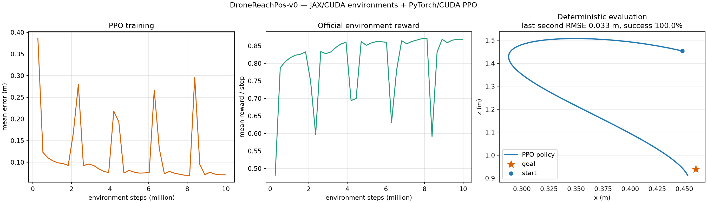

##### ReachVel：先区分可行目标和必然触地目标

策略看到 16D observation，reward 为 `exp(-||target_vel-vel||)`。该任务使用纯 PPO，不使用
teacher anchor：

```bash
python usage_assets/train_gymnasium.py \
  --env-id DroneReachVel-v0 --num-envs 4096 --num-steps 64 \
  --total-timesteps 20000000 --eval-envs 256
```

关键输出应接近：

```text
Training DroneReachVel-v0: ... 76 PPO updates (19,922,944 transitions)
eval/last_second_rmse=0.061875
eval/survival_rate=0.582031
eval/success_rate=0.582031
```

本机完整训练耗时 `21.54 s`。这里低存活率不是“速度没有收敛”：默认环境从
`[-1,1]^3 m/s` 采样目标，初始高度只有 1–2 m；若抽到持续负 `vz`，10 秒内触地是任务定义造成的
物理约束。触地后的 autoreset 环境还会重新跟踪，所以只看最终速度误差会掩盖该问题。官方分布下
reward/step 为 `0.94204`，末秒 RMSE `0.06188 m/s`，最终误差 `0.04074 m/s`，但整段存活率
和成功率都是 `58.20%`。

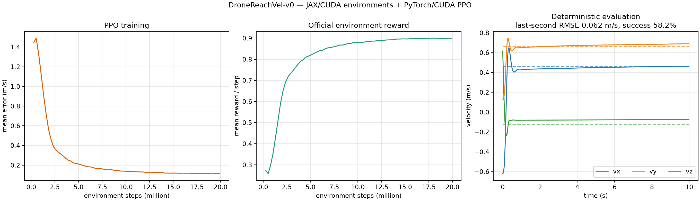

实际应用若要求完整 10 秒不触地，应先把目标约束为物理可行范围。无需修改环境源码，使用同一
checkpoint 将评估目标固定为 `vz=0`：

```bash
python usage_assets/train_gymnasium.py \
  --env-id DroneReachVel-v0 --eval-only --eval-envs 256 \
  --horizontal-velocity-eval \
  --output usage_assets/reach_vel_horizontal_ppo_result.png
```

这时 reward/step `0.95127`，末秒 RMSE `0.04940 m/s`，最终误差 `0.04934 m/s`，存活率
100%，成功率 `98.83%`。这说明策略已经学会速度跟踪，剩余差异来自任务目标的可行性。

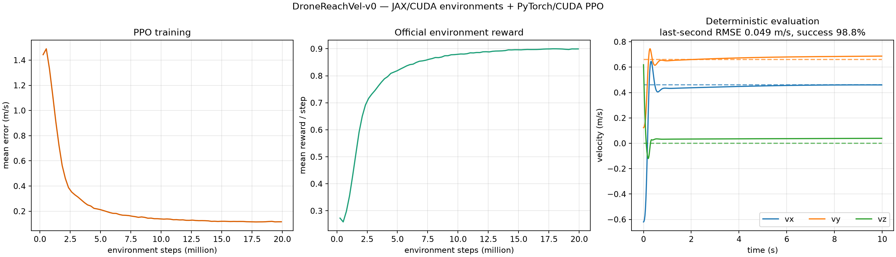

##### Landing：位置和速度必须同时收敛

Landing 的 reward 同时惩罚离目标的距离和飞行速度。纯 PPO 容易学到“远离地面保持悬停”的
局部最优：实测训练 1992 万 transitions 后末秒位置 RMSE 仍为 `0.732 m`，成功率 0%。最终配置
与 ReachPos 一样使用位置 teacher 预训练和 controller anchor：

```bash
python usage_assets/train_gymnasium.py \
  --env-id DroneLanding-v0 --num-envs 4096 --num-steps 64 \
  --total-timesteps 10000000 --eval-envs 256
```

关键输出应接近：

```text
Position behavior cloning: 1,000 batches, final MSE 0.000000
Training DroneLanding-v0: ... 38 PPO updates (9,961,472 transitions)
eval/last_second_rmse=0.028944
eval/survival_rate=1.000000
eval/success_rate=1.000000
```

本机 PPO 阶段耗时 `9.95 s`。reward/step `0.74463`，全程 RMSE `0.43011 m`，这是因为策略
必须从 1–2 m 初始高度下降到 0.1 m 目标；末秒 RMSE `0.02894 m`、最终误差 `0.02895 m`，
并同时满足末秒速度阈值，存活率和成功率均为 100%。

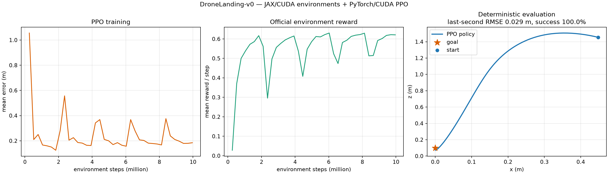

##### 汇总与跨 seed 结果

seed 7、256 个 CUDA 环境、500 steps 的统一确定性评估如下：

| 任务/评估分布 | transitions | reward/step | 全程 RMSE | 末秒 RMSE | 最终误差 | 存活率 | 成功率 |
|---|---:|---:|---:|---:|---:|---:|---:|
| ReachPos | 9,961,472 | 0.88740 | 0.13400 m | 0.03328 m | 0.03296 m | 100% | 100% |
| ReachVel，官方 `vx/vy/vz ∈ [-1,1]` | 19,922,944 | 0.94204 | 0.19833 m/s | 0.06188 m/s | 0.04074 m/s | 58.20% | 58.20% |
| 同一 ReachVel 策略，水平目标 `vz=0` | — | 0.95127 | 0.13420 m/s | 0.04940 m/s | 0.04934 m/s | 100% | 98.83% |
| Landing | 9,961,472 | 0.74463 | 0.43011 m | 0.02894 m | 0.02895 m | 100% | 100% |

同一 checkpoint 又用 seed `7/42/43/123/2026` 各评估 256 个环境：ReachPos 末秒 RMSE 为
`3.33–3.42 cm`、成功率均为 100%；Landing 为 `2.894 cm`、成功率均为 100%；ReachVel
水平目标末秒 RMSE 为 `4.72–4.94 cm/s`、存活率均为 100%、成功率为 `98.44–100%`。
官方三维 ReachVel 分布的存活率和成功率均为 `58.20–62.11%`。

三个 checkpoint 默认保存为 `saves/reach_pos_ppo.pt`、`saves/reach_vel_ppo.pt` 和
`saves/landing_ppo.pt`。`saves/` 不进入 Git 或 Docker build context；图片保留在
`usage_assets/` 供结果对照。

### 10.8 哪些功能不需要离线训练

本手册其余需要优化计算的功能已经逐项区分：Sampling MPC 每个控制周期在线筛选动作序列；
JAX gradient 示例在线优化单个命令；Mellinger 控制器是解析控制链，这三者都没有离线策略收敛过程。
系统辨识需要用户自己的真实 flight log 与独立 validation 数据，合成周期信号只能验证 API/绘图链路，
不能伪装成有参考价值的拟合收敛结果。drone racing 是另一项确实需要训练的任务，其 149.9 万环境步
GPU PPO 完整结果见 12.4 节。

## 11. Examples 全部示例

### 11.1 原官网 Examples 的 11 个主题（8 月实测）

| 官网主题 | 运行命令 | 关键结果 |
|---|---|---|
| Hover | `python examples/control/hover.py` | state controller 达到命令位置；见悬停截图 |
| Attitude control | `python examples/control/attitude.py` | 自定义 position→attitude 控制器完成螺旋上升 |
| Sampling-based MPC | `python examples/control/sampling.py` | GPU 使用 500,000 条候选、25 步 horizon，障碍物和预测轨迹正常 |
| Gradient through dynamics | `python examples/jax/gradient.py` | JIT/grad 通过；约 37.6 µs/gradient step |
| Domain randomization | `python examples/plugins/randomize.py` | mass/J/J_inv 只对 mask world 随机化 |
| Disturbance injection | `python examples/plugins/disturbance.py` | 随机 force/torque 明显改变位置与 RPY 曲线 |
| Cameras and RGB-D | `python examples/rendering/cameras.py` | 250 帧 GIF 路径通过；8.02 ms/frame |
| LED deck/materials | `python examples/rendering/led_deck.py` | 25 架 brushless drone 独立 RGBA/emission 正常 |
| Contact queries | `python examples/contacts/contacts.py` | box collision、contacts 与 X11 viewer 正常 |
| Raycasting | `python examples/rendering/raycasting.py` | one-shot 和 compiled depth 均正常 |
| Gymnasium | `python examples/environments/figure8.py` | 20 个 vector env 的接口演示通过；固定动作不是跟踪策略 |

其中 Sampling-based MPC 是在线优化，不生成训练 checkpoint。每个 50 Hz 控制周期在 GPU 上
并行 rollout 500,000 条、每条 25 步/1 秒的 attitude action sequence，并最小化：

```text
J = Σ [50 ||position-reference||² + ||velocity-reference||²
       + 5 ||roll,pitch||² + 5 (thrust-hover_thrust)² + 100 yaw_error²
       + 1000 × obstacle_hits]
```

代价最低的 1% 即 5000 条 elite sequence 用于更新控制均值，只执行新序列的第一步，然后在下一
控制周期重新规划。这解释了为什么截图中会同时出现大量浅色候选轨迹、绿色最佳预测和实际历史；
它与第 10 节 PPO 的“先离线训练、再加载权重”是两种完全不同的优化方式。

Sampling MPC 的真实 GUI 截图中，蓝线为 reference，绿色为最佳/采样预测轨迹，白柱是障碍物：

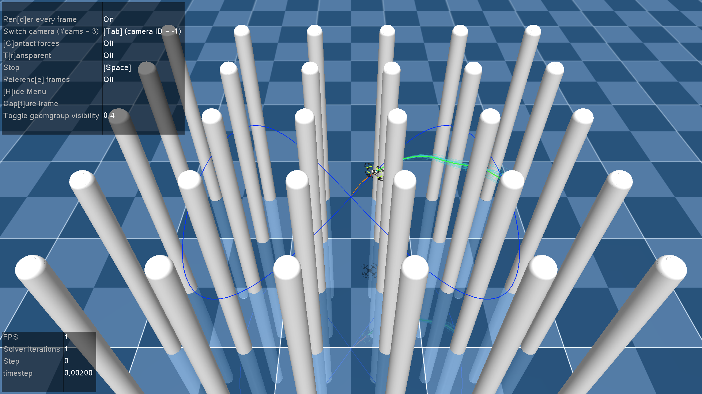

### 11.2 仓库其余可执行示例

以下保留 8 月已执行的脚本清单；本轮新增脚本和当前官网项目入口见第 15 节：

| 脚本 | 说明/结果 |
|---|---|
| `contacts/crash.py` | 悬停后飞向地面，演示 crash contact |
| `control/change_pos.py` | 用 `.replace()` 设置初始位置与 rotor speed |
| `control/force_torque.py` | 直接总力/力矩控制 |
| `control/spiral.py` | 4 架无人机 state-control 螺旋 |
| `environments/gymnasium_env.py` | `DroneReachPos-v0` + reset options + JaxToNumpy |
| `usage_assets/train_gymnasium.py` | 四个 Gymnasium 任务的 JAX/CUDA env + PyTorch/CUDA PPO 训练器 |
| `jax/cache.py` | 持久 JAX cache |
| `plugins/action_delay.py` | 30 ms action queue；平均差 27.93 cm |
| `plugins/estimation.py` | UWB + EKF + pipeline state swap |
| `rendering/cam_config.py` | 默认/自定义 free camera |
| `rendering/render.py` | 25 架 drone 与尾迹线 |
| `rendering/splat_camera.py` | 2 worlds × 2 drones splat FPV |
| `rendering/splat_depth.py` | 椭圆航线 splat depth |
| `rendering/splat_gradients.py` | 可微 FPV pose gradients |
| `rendering/splat_viewer.py` | viser web viewer 与 pose streaming |
| `symbolic.py` | CasADi symbolic dynamics + CVODES |

2026 年 8 月上游当时的全部 26 个 `main()` 已在容器执行；测试入口只 mock 了实时 `Sim.render()`，用于避免每个脚本等待 GUI，而数值循环、500k sampling、splat CUDA rasterization、CasADi 和 Gym 环境均真实运行。新增训练器又分别完成四个 Gymnasium 任务的 GPU 训练和跨 seed 评估。代表性的 X11 GUI、全部离屏模式和 web viewer 也单独实际打开并截图验证。当前源码新增了 7 个示例，历史 26/26 不代表本轮 33 个示例的执行结果。

## 12. drone racing（2026 年 8 月历史集成）

本节描述当时固定外部 racing 提交的实验，保留 13D state 接口及原训练成绩。
当前 Crazyflow state 接口是 16D；升级外部 racing 环境时需要把旧 yaw 标量转换成 `xyzw`
四元数，再放入 `cmd[..., 9:13]`，把 body rates 放入 `13:16`。
本轮重新训练与赛道复验见第 15.9.3 节；下述成绩仍保留为 8 月历史记录。

镜像固定到 2026-08-11 的上游提交：

```bash
git -C /opt/lsy_drone_racing log -1 --oneline
# 065a6ec Pixi run mocap runs now also nominal_frame_publisher...
```

相对之前的 `9ecb1cb`，上游新增两项：mocap task 同时启动 `nominal_frame_publisher` 并加载专用 RViz 配置，以及 Ruff pre-commit hook；仿真、控制和训练核心无改动。`.devcontainer/lsy_drone_racing-compat.patch` 在最新提交可干净应用。

### 12.1 赛道环境的 observation、action 与结束条件

`DroneRacing-v0` 的 observation 不只是机体状态，还包含赛道感知和过门进度。以 `level0.toml`
的 4 gates、4 obstacles 为例：

| observation | shape | 含义 |
|---|---:|---|
| `pos`, `quat`, `vel`, `ang_vel` | 3 / 4 / 3 / 3 | 当前机体状态 |
| `n_gates_passed` | scalar | 已按顺序通过的 gate 数量 |
| `gate_sequence` | `(4,)` | 0-based gate ID 顺序 |
| `gate_sequence_direction` | `(4,)` | 每次应正向还是反向通过 |
| `gates_pos`, `gates_quat` | `(4,3)` / `(4,4)` | gate 位置与姿态 |
| `gates_visited` | `(4,)` | 是否已进入传感器范围并获得真实 gate pose |
| `obstacles_pos` | `(4,3)` | obstacle 位置 |
| `obstacles_visited` | `(4,)` | 是否已获得真实 obstacle pose |

未进入 `sensor_range` 的物体返回 nominal pose，进入范围后才返回 randomized true pose。这使控制器
能在 level 1–3 处理中途发现的赛道偏差。环境支持两种 action，必须和控制器输出维度一致：

| `control_mode` | action | 适用控制器 |
|---|---|---|
| `state` | 13D：`pos(3), vel(3), acc(3), yaw, body_rate(3)` | 默认 `state_controller.py` |
| `attitude` | 4D：`roll, pitch, yaw, total_thrust` | `attitude_controller.py`、`attitude_rl.py` |

`level0.toml` 默认是 `state`。把输出 4D 的 `attitude_rl.py` 直接配给它会得到 13D/4D shape
错误；运行学习策略前必须把 `env.control_mode` 改为 `attitude`。

赛道环境把碰撞、越出 safety limits 或完成全部 gates 的 drone 标记为 disabled，并返回
`terminated=True`；默认达到 1500 个环境步即 30 秒时返回 truncated。核心环境自带的 sparse reward 只在
完成 gate sequence 后给 `-1`，源码也明确提示它不适合直接训练 RL。常规赛道脚本不靠累计 reward
判定成绩，而是检查 `n_gates_passed` 和完成时间。

### 12.2 运行单机、多机和训练好的控制器

默认单机 state controller 和多机入口：

```bash
cd /opt/lsy_drone_racing
python scripts/sim.py --config level0.toml --render False
python scripts/multi_sim.py --config multi_level0.toml --render False
```

单机结束时会打印：

```text
Flight time (s): 16.52
Finished: True
Gates passed: 4
```

完整实测：

| 场景 | 结果 |
|---|---|
| 单机 `level0.toml` | 16.52 s，完成，4/4 gates |
| `attitude_controller_multi.py` | 10.10 s，完成，4/4 gates |
| `attitude_mpc_multi.py` | 13.43 s，完成，4/4 gates |

训练好的 PPO policy 输出 attitude action。可以复制一份临时配置，不修改上游 checkout：

```bash
cd /opt/lsy_drone_racing
cp config/level0.toml /tmp/level0-attitude.toml
sed -i 's/control_mode = "state"/control_mode = "attitude"/' \
  /tmp/level0-attitude.toml
python scripts/sim.py \
  --config /tmp/level0-attitude.toml \
  --controller attitude_rl.py \
  --render False
```

该命令已用本节训练出的 checkpoint 实际完成赛道：`13.34 s`、`Finished: True`、4/4 gates。
训练时 policy 和环境都在 GPU；`attitude_rl.py` 做单机部署推理时按上游实现把网络加载到 CPU，
再把 4D action 交给 Crazyflow attitude controller。

启用真实可视化：

```bash
python scripts/sim.py --config level0.toml --render True
# 或显示训练策略：
python scripts/sim.py \
  --config /tmp/level0-attitude.toml \
  --controller attitude_rl.py --render True
```

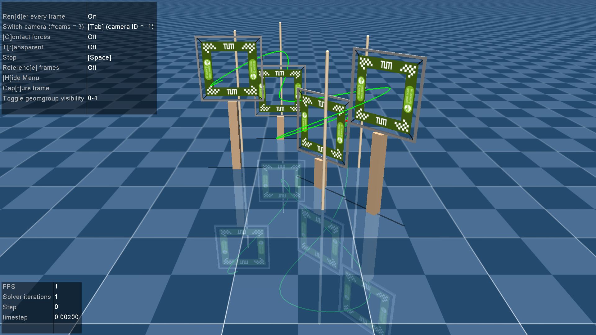

### 12.3 drone racing PPO 到底训练了什么

上游 `train_rl.py` 没有直接优化第 12.1 节的 sparse gate reward。它构造 `RandTrajEnv`：每个
episode 用 10 个 waypoint 插值出一条 15 秒随机三维样条，先训练通用 attitude trajectory
tracker；`attitude_rl.py` 再为真实赛道构造确定性样条并调用该 tracker。这种分层方法把“规划经过
哪些 gates”和“低层稳定跟踪轨迹”分开。

训练 policy 的实际输入是 73D：

| 组成 | 维数 | 内容 |
|---|---:|---|
| 当前状态 | 13 | `pos, quat, vel, ang_vel` |
| 未来轨迹 | 30 | 未来 10 个点、间隔 0.1 s 的相对位置 |
| 状态历史 | 26 | 前 2 帧的 13D 状态 |
| 上一步 action | 4 | 用于学习平滑控制 |

action 是 normalized `[roll,pitch,yaw,total_thrust] ∈ [-1,1]^4`；对 `cf21B_500`，映射后的总
推力范围为 `[0.08545,0.8] N`。训练 wrapper 会把真正送入仿真的 yaw command 固定为 0。

记当前参考点误差为 `e_p`、归一化 action 为 `a`、动作差为 `Δa`，训练 reward 是：

```text
r_base = exp(-2 ||e_p||₂)                 # 越贴近随机样条越好
r = r_base
    - 0.06 ||roll,pitch,yaw||₂            # 避免大姿态
    - 0.02 a_thrust²                       # 减少过大推力命令
    - 0.40 Δa_thrust²                      # 推力变化平滑
    - 1.00 ||Δa_roll,pitch,yaw||₂²         # 姿态命令变化平滑
```

越出 `x/y∈[-4,4] m` 或 `z∈[0,4] m` 时，`r_base` 变为 `-1` 并 terminated；15 秒即 750 steps
后 truncated。因而 evaluation reward `713.37` 是 750 步 shaped trajectory-tracking reward 的
总和，不是通过 gate 的数量；是否真正通过赛道必须运行第 12.2 节的 `scripts/sim.py`。

### 12.4 GPU PPO 训练配置、命令和结果

```bash
cd /opt/lsy_drone_racing
python -m lsy_drone_racing.control.train_rl --wandb-enabled False
```

该命令先训练、保存 checkpoint，再运行一次确定性 evaluation。只评估现有 checkpoint：

```bash
python -m lsy_drone_racing.control.train_rl \
  --wandb-enabled False --train False --eval 5
```

网络与优化配置：

| 项目 | 值 |
|---|---:|
| actor / critic | 各两层 64-unit Tanh MLP |
| optimizer | AdamW，初始 learning rate `1.5e-3`，线性退火 |
| 并行环境 × rollout | `1024 × 8 = 8192` transitions/update |
| minibatches × epochs | 8 × 10 |
| `gamma` / `GAE lambda` | 0.94 / 0.97 |
| PPO clip | 0.26 |
| entropy / value coefficient | 0.007 / 0.7 |
| gradient norm | 1.5 |
| PPO updates | 183 |

最新上游源码的完整实测：

| 项目 | 结果 |
|---|---|
| 环境设备 | JAX `gpu` |
| 策略设备 | PyTorch `cuda` |
| 并行环境 | 1,024 |
| rollout / iteration | 8 steps |
| iterations | 183 |
| 总环境步 | 1,499,136 |
| 训练时间 | 56.64 s |
| evaluation reward | 713.37 |
| evaluation length | 750 steps |
| 独立重载 checkpoint，5 episodes | 平均 701.19，范围 696.81–707.54，均为 750 steps |

训练开始时应看到 `Training on device: cuda | Environment device: gpu`；结束时打印
`Training for 1499136 steps took 56.64 seconds` 和 `Average Reward = 713.37, Length = 750.0`。
checkpoint 保存到 `lsy_drone_racing/control/ppo_drone_racing.ckpt`。兼容补丁使 evaluation 也
显式选择 CUDA，并让 `JaxToTorch` 保持 JAX/CUDA 与 Torch/CUDA 的设备转换。这里每次 evaluation
都会生成新的随机样条，所以单 episode reward 不应当被当作固定常数；上面的 5-episode 重载结果
更适合判断 checkpoint 是否仍在同一性能量级。

### 12.5 Acados 与 mocap 范围

容器已构建 acados v0.5.1、安装 `acados_template`、生成 `libacados.so` 和 `t_renderer`；多机 MPC 控制器已实际通过赛道。

最新 `pixi run -e deploy mocap` 属于 ROS2、motion-capture hardware 与 RViz 的部署环境，不属于当前 Dockerfile 安装的 `[gamepad,rl]` 仿真/RL extra，因此未在无硬件容器中宣称通过。它的上游 shell 和 RViz 配置已进入固定提交，但执行仍需部署机上的 ROS2/mocap 系统。

## 13. API 速查

| 模块 | 主要公开用法 |
|---|---|
| `crazyflow` | `Sim`, `Dynamics`, `Control`, `Drone` |
| `crazyflow.sim` | `Sim`, `Dynamics` |
| `crazyflow.sim.functional` | 五种 functional control、`controllable` |
| `crazyflow.sim.sharding` | `world_mesh`, `shard`, `placement` |
| `crazyflow.sim.integration` | `Integrator`, `euler`, `rk4`, `symplectic_euler` |
| `crazyflow.sim.pipeline` | append/prepend/insert/replace/remove stage |
| `crazyflow.sim.visualize` | `draw_line`, `draw_points`, `draw_capsule`, `change_material` |
| `crazyflow.sim.sensors.depth` | `render_depth`, `build_render_depth_fn` |
| `crazyflow.sim.splat` | `attach_splats`, `SplatViewer` |
| `crazyflow.sim.sensors.splat` | RGB/RGB-D one-shot 与 compiled render builders |
| `crazyflow.dynamics` | `Dynamics`, `available_dynamics`, `dynamics_features`, `parametrize`, `load_params`, `load_fn_params`, `supported_dynamics`, `supported_drones` |
| 各 dynamics package | `dynamics`, `sim_dynamics`, `symbolic_dynamics`；拟合模型另有 Euler variant |
| `crazyflow.dynamics.utils` | preprocessing、SVF derivatives、translation/rotation identification |
| `crazyflow.control` | `Control`, `parametrize`, `load_params`, `load_fn_params` |
| `crazyflow.control.mellinger` | 三段控制链、`body_rate2force_torque` 及其显式 state data |
| `crazyflow.envs` | 四个 task env、`NormalizeActions` |
| `crazyflow.drones` | `Drone`；物理参数入口改为 `crazyflow.dynamics.load_params` |
| `crazyflow.utils` | `CORE_NDIM_KEY`, `world_mask`, `leaf_replace` |

完整函数签名、参数类型和源代码可继续查阅官方 [API Reference](https://learnsyslab.github.io/crazyflow/api/)。

## 14. 验证清单（2026 年 8 月历史记录）

| 范围 | 结果 |
|---|---:|
| User Guide 可执行 Markdown code fences | 77/77 passed |
| 上游仓库 Examples `main()` | 26/26 passed |
| Figure-eight PPO | 4096 CUDA env、1992 万 transitions、跨 seed RMSE 3.87–4.00 cm |
| ReachPos / Landing | 各 4096 CUDA env、996 万 transitions；跨 seed 末秒 RMSE 3.33–3.42 / 2.894 cm，成功率 100% |
| ReachVel PPO | 4096 CUDA env、1992 万 transitions；水平目标跨 seed 成功率 98.44–100% |
| 系统辨识 integration cases | 4/4 passed |
| 官方仓库完整测试集 | 511 passed, 27 skipped, 12 deselected |
| Render tests | 11/11 passed |
| X11/OpenGL | NVIDIA direct rendering，MuJoCo GUI 已实际打开 |
| Offscreen RGB/depth/RGB-D | shape、dtype、有限值检查通过 |
| Gaussian splat RGB/RGB-D/grad/viewer | CUDA rasterization 与浏览器连接通过 |
| Gym IDs | 4/4 在 JAX/CUDA reset + step |
| drone racing | 最新固定提交单机/双机/acados/完整 PPO 通过；训练策略 attitude 配置 13.34 s 完成 4/4 gates |
| 外网 | Docker build 末尾与容器内 `curl https://www.google.com/` 均 200 |

8 月验证中没有修改 `crazyflow/` 核心源码或 `tests/`。当时新增内容只包括 Docker/devcontainer
配置、外部项目兼容补丁、本文和本文截图。本轮 main 同步会带入上游核心源码及测试更新；
新的检查结果独立记录在第 15.9 节。

## 15. 2026-10-09 官方 main 增量同步

本轮以 research 已包含的官方 `58e8fb4`（0.3.0）为基线，检查并同步至
[`70d09e4`](https://github.com/learnsyslab/crazyflow/commit/70d09e4)（2026-10-08），
共 32 个后续提交。包版本字符串为 0.3.2，但 main 包含 0.3.2 发布后的功能，复现时应同时
记录 Git commit，不能只比较版本号。既有章节、历史实验、训练命令和图片继续保留。

### 15.1 所有新增 commits 与用法影响

以下按官方提交顺序列出；链接均指向官方仓库。

| 日期 | Commit | 更新与本手册落点 |
|---|---|---|
| 08-18 | [`9ec877b`](https://github.com/learnsyslab/crazyflow/commit/9ec877b) | 修复控制器批处理；保留任意前导轴用法（5.4） |
| 08-20 | [`6315177`](https://github.com/learnsyslab/crazyflow/commit/6315177) | 多设备 sharding 与 world-axis 元数据（15.4） |
| 08-20 | [`40a3e8c`](https://github.com/learnsyslab/crazyflow/commit/40a3e8c) | 枚举改为 StrEnum，支持枚举或字符串参数（2.1、15.3） |
| 08-20 | [`12dff99`](https://github.com/learnsyslab/crazyflow/commit/12dff99) | 加入 Python 3.14 支持；本轮环境另列于 note |
| 08-20 | [`ef95e05`](https://github.com/learnsyslab/crazyflow/commit/ef95e05) | 发布 0.3.1 |
| 08-26 | [`7958133`](https://github.com/learnsyslab/crazyflow/commit/7958133) | splax 球谐颜色支持（9、15.8） |
| 08-26 | [`764d29e`](https://github.com/learnsyslab/crazyflow/commit/764d29e) | splat 插件改为 flax dataclass（9、15.8） |
| 08-26 | [`dede875`](https://github.com/learnsyslab/crazyflow/commit/dede875) | 发布 0.3.2 |
| 09-06 | [`3015525`](https://github.com/learnsyslab/crazyflow/commit/3015525) | 增加 rotor command clipping（6、15.5） |
| 09-08 | [`3980e2b`](https://github.com/learnsyslab/crazyflow/commit/3980e2b) | 旋转辨识用 Euler 模型，修复无 validation 绘图（4.6） |
| 09-08 | [`499e33a`](https://github.com/learnsyslab/crazyflow/commit/499e33a) | 扩展逐 world/drone/motor 参数随机化（6.2、15.5） |
| 09-08 | [`a317eda`](https://github.com/learnsyslab/crazyflow/commit/a317eda) | 新增四种动力学对照示例（15.8） |
| 09-10 | [`af22178`](https://github.com/learnsyslab/crazyflow/commit/af22178) | SimData 支持 buffer donation，初始化分开分配字段缓冲区（15.4） |
| 09-10 | [`7124e7c`](https://github.com/learnsyslab/crazyflow/commit/7124e7c) | 修正 rotor clipping 作用位置（15.5） |
| 09-10 | [`1142d28`](https://github.com/learnsyslab/crazyflow/commit/1142d28) | 新增 body rate 接口、控制器和频率参数（2.2、15.2） |
| 09-15 | [`1421b88`](https://github.com/learnsyslab/crazyflow/commit/1421b88) | state command 从 13D 改为 cflib 对齐的 16D（1.3、2.2、5、15.2） |
| 09-17 | [`db6f943`](https://github.com/learnsyslab/crazyflow/commit/db6f943) | mesh 构造时直接分片初始化，避免先在一张卡分配全部数据（15.4） |
| 09-18 | [`5e53832`](https://github.com/learnsyslab/crazyflow/commit/5e53832) | 拟合模型按总推力裁剪，范围为每电机范围的 4 倍（15.5） |
| 09-19 | [`9fe6749`](https://github.com/learnsyslab/crazyflow/commit/9fe6749) | 参数移至模型文件；区分 load_params/load_fn_params（4.3、5.4） |
| 09-20 | [`2fa2241`](https://github.com/learnsyslab/crazyflow/commit/2fa2241) | 修复多机、碰撞和 MJX 数据 sharding（15.4） |
| 09-21 | [`edf2e36`](https://github.com/learnsyslab/crazyflow/commit/edf2e36) | 大规模 swarm 的场景构造、碰撞和 step 编译优化（15.4） |
| 09-22 | [`9644708`](https://github.com/learnsyslab/crazyflow/commit/9644708) | Drone 枚举和 supported_* 自动查询；新增添加机型文档（2.1、15.3） |
| 09-24 | [`36f584d`](https://github.com/learnsyslab/crazyflow/commit/36f584d) | 新增 Holybro X500 V2 模型和拟合参数（15.3） |
| 09-25 | [`1590e2b`](https://github.com/learnsyslab/crazyflow/commit/1590e2b) | 新增地效插件和悬停高度/推力实验（15.7） |
| 09-26 | [`f9ce54d`](https://github.com/learnsyslab/crazyflow/commit/f9ce54d) | 更新机型质量、阻力、转子及推力参数；历史结果需重新评估 |
| 09-30 | [`d28ec70`](https://github.com/learnsyslab/crazyflow/commit/d28ec70) | 新增下洗插件和双机穿越实验（15.7） |
| 10-07 | [`0c1e70c`](https://github.com/learnsyslab/crazyflow/commit/0c1e70c) | 方程与论文对齐、外力矩为世界坐标、thrust_dyn_coef、推力偏置单位（1.1、4.6） |
| 10-07 | [`afb5f56`](https://github.com/learnsyslab/crazyflow/commit/afb5f56) | Gymnasium 最低版本升至 1.4（10、note） |
| 10-07 | [`1d71b45`](https://github.com/learnsyslab/crazyflow/commit/1d71b45) | 修正 quaternion derivative（15.6） |
| 10-07 | [`5c057b7`](https://github.com/learnsyslab/crazyflow/commit/5c057b7) | 更新 CODEOWNERS，无运行接口变化 |
| 10-08 | [`62a3146`](https://github.com/learnsyslab/crazyflow/commit/62a3146) | 移除 SimData.states_deriv，修复 symplectic 积分，新增导数插件例子（15.6） |
| 10-08 | [`70d09e4`](https://github.com/learnsyslab/crazyflow/commit/70d09e4) | 新增基于 Crazyflow 的项目入口（15.8） |

### 15.2 16D state 与 body rate

当前 state 命令是 `pos(3), vel(3), acc(3), quat_xyzw(4), body_rate(3)`。
只有目标位置时仍需有效姿态，零 yaw 对应 `cmd[..., 12] = 1`。旧 13D 命令可转换为：

```python
import numpy as np
from crazyflow import Control, Sim
from scipy.spatial.transform import Rotation as R

old = np.zeros((1, 1, 13), dtype=np.float32)
old[..., 2] = 0.5
old[..., 9] = 0.3  # yaw，rad
new = np.zeros(old.shape[:-1] + (16,), dtype=old.dtype)
new[..., :9] = old[..., :9]
new[..., 9:13] = R.from_euler("z", old[..., 9].reshape(-1)).as_quat().reshape(old.shape[:-1] + (4,))
new[..., 13:16] = old[..., 10:13]
sim = Sim(control=Control.state)
sim.state_control(new)
sim.step(50)
sim.close()
```

body rate 直接绕过 position/attitude 命令接口，输入机体系角速度和总推力；适用于输出 rate
的策略或外环控制器，仅支持 first-principles。若希望取消默认回水平项：

```python
import jax.numpy as jnp
from crazyflow import Control, Dynamics, Sim

sim = Sim(control=Control.body_rate, dynamics=Dynamics.first_principles, body_rate_freq=250)
body_rate = sim.data.controls.body_rate
params = body_rate.params | {"kR": jnp.zeros(3), "ki_m": jnp.zeros(3)}
sim.data = sim.data.replace(controls=sim.data.controls.replace(body_rate=body_rate.replace(params=params)))
sim.build_default_data()
sim.reset()
cmd = jnp.zeros((1, 1, 4)).at[..., 3].set(sim.data.params.mass[0] * 9.81)
sim.body_rate_control(cmd)
sim.step(sim.freq // sim.control_freq)
sim.close()
```

运行 `python examples/control/body_rate.py` 可重现 6.5 s 圆周加缓慢上升，外环用
`state2attitude` 和姿态误差生成 rate。对照实验保持机型、初态和轨迹相同，仅切换 `kR/ki_m`
是否为零，记录位置 RMSE、角速度 RMSE、总推力和 motor saturation；不要用 fitted X500
运行该控制模式。Standalone 对应函数是 `body_rate2force_torque`，functional 入口是
`F.body_rate_control(data, cmd)`。

### 15.3 Holybro X500 V2 与支持矩阵

当前 X500 是 2.28 kg 的拟合平台，支持 `so_rpy`、`so_rpy_rotor`、`so_rpy_rotor_drag`；
尚无 first-principles 参数。因此要显式选择拟合模型，不能只改 `drone` 后使用默认动力学。
四种 Crazyflie 配置则各支持全部四种动力学。

```python
import numpy as np
from crazyflow import Control, Drone, Dynamics, Sim
from crazyflow.dynamics import supported_drones, supported_dynamics

print(supported_dynamics(Drone.hb_x500))
print(supported_drones(Dynamics.first_principles))
sim = Sim(drone=Drone.hb_x500, dynamics=Dynamics.so_rpy_rotor_drag, control=Control.state)
cmd = np.zeros((1, 1, 16), dtype=np.float32)
cmd[..., 2], cmd[..., 12] = 1.0, 1.0
sim.state_control(cmd)
sim.step(5 * sim.freq)
print(np.asarray(sim.data.states.pos), np.asarray(sim.data.params.mass))
sim.close()
```

实验建议依次运行三个拟合模型，对相同 1 m 高度阶跃记录 `|z-1|`、超调和末秒 RMSE，再用
`so_rpy_rotor_drag` 跟踪含速度/加速度前馈的轨迹。参数是针对该机型辨识的模型；一段有限值
悬停检查不能证明真实硬件跟踪精度。添加新机型需要 `Drone` 成员、同名 MJCF 及各模型和
控制器的参数 section，完整流程见仓库 [adding-drones](docs/user-guide/adding-drones.md)。

### 15.4 World axis、多设备 sharding 与 donation

masked reset 与 sharding 用字段的 `CORE_NDIM_KEY` 判断 world axis，不能仅看第一维是否
等于 `n_worlds`。默认共享的 `(3,3)` 惯量/阻力矩阵和 `(3,)` 重力即使恰好有 3 个 world
也保持共享。裸字典数组缺少字段元数据，masked reset 保留它，sharding 复制它。

多 world 动作队列可这样声明：

```python
import flax.struct
import jax.numpy as jnp
from jax import Array
from crazyflow import Sim
from crazyflow.utils import CORE_NDIM_KEY, world_mask

@flax.struct.dataclass
class DelayState:
    queue: Array = flax.struct.field(metadata={CORE_NDIM_KEY: 3})  # delay × drones × command

sim = Sim(n_worlds=4, n_drones=2)
queue = jnp.zeros((4, 15, 2, 4))  # world 在第一轴，移位时沿 delay 轴1
sim.data = sim.data.replace(plugins=sim.data.plugins | {"delay": DelayState(queue)})
sim.build_default_data()
assert world_mask(sim.data).plugins["delay"].queue
assert not world_mask(sim.data).params.gravity_vec
sim.reset(mask=jnp.array([True, False, True, False]))
sim.close()
```

用于 CPU 验证 sharding 的现成脚本会在 import JAX 前创建 4 个逻辑 CPU device：

```bash
python examples/jax/sharding.py
```

该脚本比较单设备与分片的 16 world、10 tick 位置，断言 `allclose(atol=1e-6)`，并打印
`position: PartitionSpec('worlds')`、`gravity: PartitionSpec()` 及每设备 4 个 world。
它验证布局和数值一致性；逻辑 CPU 分片不能作为多 GPU 加速结果。

实际多 GPU 可以在创建时传 `mesh`，避免先在单设备分配全部数据：

```python
import jax
from crazyflow import Sim
from crazyflow.sim.sharding import world_mesh

devices = jax.devices("gpu")
mesh = world_mesh(devices)  # 自动分片模式；不要直接依赖 make_mesh 的 explicit 默认值
sim = Sim(n_worlds=128 * len(devices), n_drones=8, device="gpu", mesh=mesh, fused_mjx_model=True)
sim.step(10)
print(sim.data.states.pos.sharding, sim.mjx_data.mocap_pos.sharding)
sim.close()
```

`n_worlds` 必须能被设备数整除；现有 sim 可用 `sim.shard(mesh)` 同时重放置当前/默认数据和 MJX
数据。性能实验固定 world 总量、drone 数与 `n_steps`，预热一次，计时前后调用
`jax.block_until_ready(data)`；记录设备数、吞吐、初始化峰值显存和编译时间。
`fused_mjx_model=True` 可减少场景开销，box collision 成本应单独报告。

当前 `build_step_fn()` 默认不捐赠参数。需要 donation 时显式包一层 JIT，并为实验分支复制
输入，使默认 reset 数据和外部持有的初态保持可用：

```python
import jax
from crazyflow import Sim

sim = Sim(n_worlds=16)
step = sim.build_step_fn()
advance = jax.jit(lambda data: step(data, 10), donate_argnums=(0,))
data = jax.tree.map(lambda x: x.copy(), sim.data)
data = advance(data)  # 之后仅使用返回的新 data，旧输入 buffer 可能已失效
jax.block_until_ready(data)
sim.close()
```

若多个字段引用同一 JAX buffer，需先复制成独立叶子；不要把已 donation 的输入再次用于
reset、梯度分支或 baseline。启用/禁用 donation 的比较应使用独立副本、同一编译配置和相同
同步口径，记录峰值内存及吞吐，不能把编译时间计入稳态速度。

### 15.5 Clipping、梯度与参数随机化

默认 pipeline 在控制器之后、积分之前执行 `clip_rotor_vel_cmd`。first-principles 裁剪
四路 RPM 命令，拟合模型裁剪已生效的 attitude collective thrust，范围是
`[4*thrust_min, 4*thrust_max]` N。`rotor_vel_limits(sim.dynamics, sim.drone)` 可读取范围；
裁剪的是 command，积分器仍按转子/推力动态推进 state。

```bash
python examples/jax/gradient_clipping.py
python examples/plugins/randomize.py
```

第一个实验从 2 m 初始高度开始，命令依次上升到 `upper+10000` RPM、保持、下降，每段
250 tick（500 Hz 下 0.5 s），比较默认 clipping、straight-through clipping、移除 clipping
三组 rotor state 与 `d acc_z / d cmd`。加速度用一步 lookahead 测量，因为当前 command 经
下一个 rotor state 才影响加速度。记录饱和区梯度比例、最大转子状态和两种 clipping 前向
轨迹差；straight-through 前向相同但梯度是人为估计，不是硬饱和函数的真实导数。

随机化例子以 `default_data` 为基准按 mask 重抽样，当前可用形状/示例幅度为：

| 参数 | 逐 world/drone/motor 形状 | 示例变化范围 |
|---|---|---|
| mass | `(N,M,1)` | ±10% |
| J / J_inv | `(N,M,3,3)` | J 各元素 ±10%，重新求逆 |
| rpm2thrust / rpm2torque | `(N,M,4,3)` | ±5% / ±10% |
| rotor_dyn_coef | `(N,M,4,4)` | ±5% |
| prop_inertia / L | `(N,M,4)` | ±20% / ±1% |
| drag_matrix | `(N,M,3,3)` | ±30% |

复现实验固定 rng seed，使用 3 worlds × 4 drones，仅 reset 第一个 world；检查其他 world
参数逐元素相等、被选 world 参数落在范围内、`J @ J_inv` 接近单位矩阵，并确认多次 reset
仍以默认值为基准。上述 ± 范围是示例配置，自定义大幅随机化应保持正质量和正定惯量。

### 15.6 导数插件与积分器比较

当前位置/速度读取方式不变；加速度等不再常驻 `SimData.states_deriv`。使用
[derivatives.py](examples/plugins/derivatives.py) 在积分前调用动力学存入
`data.plugins["states_deriv"]`，在积分后对前后两帧计算差分，存入
`data.plugins["fd_states_deriv"]`。类型仍为 `SimStateDeriv`。

```bash
python examples/plugins/derivatives.py
```

该实验对 Euler 和 RK4 各跟踪 10 s figure-eight，打印 `vel / ang_vel / acc / ang_acc /
rotor_acc` 的最大相对差。动力学给的是前一状态处的瞬时导数；差分给的是过去一个 tick
的平均变化。Euler 的对应量应接近浮点误差，RK4 存在离散差别，不能把它解释为导数插件
错误。角速度差分用相邻四元数的相对旋转，不能逐元素对四元数直接相减。

symplectic Euler 当前先更新速度/角速度再推进位置/姿态，并修复了新角速度的使用。积分器
实验应固定机型、初态、频率和控制命令，比较轨迹/四元数范数；任何积分器的
`sim.data.states.quat` 都应保持 `xyzw` 单位四元数。新导数插件本身不替代训练器的奖励或
观测定义；需要将加速度加入 observation 时应显式规定它的时间点。

### 15.7 地效与下洗的可复现实验

两者是官方示例中的外力/力矩插件，均通过 `insert_fn_before(..., "integration", fn)`
启用，默认 `Sim` 不自动开启。地效参数与下洗常数针对 `cf21B_500`，不能直接迁移到 X500。

```bash
python examples/plugins/ground_effect.py
python examples/plugins/downwash.py
```

地效按当前 rotor thrust 估算额外升力，沿 body z 转换成 world force。
原例使用桨径 55 mm、`MU=2`、最低高度 0.02 m、最大增益 2；在
`np.linspace(0.50, 0.02, 15)` 的 15 个高度点各稳定 10 s、采样末尾 0.2 s 的平均高度和
送入 mixer 的总推力。与未插入插件的 baseline 对照时，保持起始 0.5 m 高度、控制器和
采样设置一致，画“实测高度—平均总推力”，并记录每点高度误差。近地悬停所需 command
降低是模型预测，只有重新执行后测得的数据才能列为本轮实验结果。

下洗例子让上机悬停在 1.2 m，下机先在 0.5 m 慢速/快速穿过，再升到 0.95 m 近距离穿过；
记录两机 z、下机 world-z 外力和 world-y 外力矩。模型对每个来源无人机、每个目标转子与
质心计算远场流速，再估算推力损失、阻力与力矩；使用桨半径 27.5 mm、对角电机距 0.1 m、
推力衰减系数 `0.07 s/m`。实验应加一个相同 waypoint 的无插件 baseline，并比较最大高度
偏差和最大外力/力矩；进一步改变上下间距时保持穿越速度相同，改变速度时保持间距相同。
该远场拟合不表示任意机型、近距离或任意随机参数的气动真值。

这些示例直接写入 `states.force/torque`。同时叠加地效、下洗和风时，应在每 tick 的开始
明确置零，再逐个累加各插件的 world-frame wrench，避免后一个插件覆盖前一个。控制命令
中的 force/torque 与外部 wrench 的坐标不同，参考第 1.1 节。

### 15.8 新示例、splat 与官方项目入口

| 新脚本 | 运行方式 | 实验输出/用途 |
|---|---|---|
| [control/dynamics.py](examples/control/dynamics.py) | `python examples/control/dynamics.py` | 同一轨迹比较四种动力学的姿态/推力状态 |
| [control/body_rate.py](examples/control/body_rate.py) | `python examples/control/body_rate.py` | 外环生成 body rate，6.5 s 圆周上升 |
| [jax/sharding.py](examples/jax/sharding.py) | `python examples/jax/sharding.py` | 四逻辑 CPU 分片与单设备数值对照 |
| [jax/gradient_clipping.py](examples/jax/gradient_clipping.py) | `python examples/jax/gradient_clipping.py` | 默认裁剪、straight-through、无裁剪的梯度对照 |
| [plugins/ground_effect.py](examples/plugins/ground_effect.py) | `python examples/plugins/ground_effect.py` | 15 个悬停高度与 command thrust |
| [plugins/downwash.py](examples/plugins/downwash.py) | `python examples/plugins/downwash.py` | 双机穿越、外力/外力矩与速度场 |
| [plugins/derivatives.py](examples/plugins/derivatives.py) | `python examples/plugins/derivatives.py` | Euler/RK4 瞬时导数与有限差分 |

splat 的 one-shot/builders 入口沿用第 9 节；自定义资产需检查球谐维度匹配，加载后使用
`SplatData.sh_colors`、`.logit_opacities`、`.slices` 和 `.params`。依赖要求为
`splax[viewer]>=0.2.0`；相机仍需 NVIDIA GPU。复现实验至少记录分辨率、world/drone 数、
shape、有限值、RGB/深度范围和相机位姿梯度，固定 PLY 文件与下载 URL。本轮 GPU test_splat 与完整测试集已验证
RGB/RGB-D/gradient CUDA 渲染；第 9 节的 8 月图片仍作为历史展示。

官方新增 [Projects](docs/projects.md) 页面提供四个独立项目入口：
[drone racing](https://github.com/learnsyslab/lsy_drone_racing)、
[crazyflow_experiments](https://github.com/learnsyslab/crazyflow_experiments)、
[swarmGPT](https://github.com/learnsyslab/swarmGPT)、
[crazyflow_uwb](https://github.com/learnsyslab/crazyflow_uwb)。该 commit 新增的是项目目录文档，
这些项目的代码/数据不包含在本仓库；第 12 节 racing 的历史固定提交不会随 main 合并自动
升级。

### 15.9 本轮实际验证结果（2026-10-09）

统一复现脚本是 [research_update_experiments.py](usage_assets/research_update_experiments.py)：

```bash
python usage_assets/research_update_experiments.py --device gpu
XLA_FLAGS=--xla_force_host_platform_device_count=2 \
  python usage_assets/research_update_experiments.py --mode sharding --device cpu
```

默认将软件版本、原始数值和断言记录到 `usage_assets/research_update_results.json`、
`research_update_results.md`，并保存 `research_update_20261009.png`；CPU 分片结果保存为
`research_update_sharding.json`。用 `--output-dir /tmp/crazyflow-recheck` 可将新运行结果写到
独立目录，方便与本次保存结果对照。

本轮正式验证全部在 Docker 容器 `dzp-crazyflow-research-20261009` 内执行，镜像为
`dzp_crazyflow:0.3.2-research-20261009-cuda12.6-py312-racing-rl`。容器的锁定环境为
Python 3.12.15、JAX/jaxlib 0.11.1、
NumPy 2.5.3、SciPy 1.18.0、MuJoCo/MJX 3.10.0、Gymnasium 1.4.0、flax 0.12.9。
它与第 0.2 节的 8 月容器环境分开记录；本轮结果不包含宿主机临时调试数据。

关键 API 已在上述 Docker 内直接执行本手册中的 26 个 Python 代码块：16D 迁移、五种 control 的既有/新增
入口、参数加载、独立控制器、masked randomization、world-axis 插件、mesh 初始化、X500
和 buffer donation 均通过。此项检查用 CPU 替换片段中的 GPU placement；它验证接口，
不计入多 GPU 性能或 CUDA 渲染验证。全部 56 个 Python 代码块的语法及本地链接检查通过；
动作延迟代码已补齐独立函数，保存为临时脚本时也可执行。

#### 15.9.1 新功能的 Docker / CUDA 实测

原始版本、数值与断言见 [GPU feature JSON](usage_assets/research_update_results.json)、
[实验逐项报告](usage_assets/research_update_results.md) 和
[2 CPU 分片 JSON](usage_assets/research_update_sharding.json)。GPU 为 NVIDIA GeForce
RTX 4070 Ti SUPER，`cuda:0`；使用 float32、500 Hz 动力学、seed 0。8 组功能实验与单独
2 逻辑 CPU device 的分片实验均完成，全部断言通过。

| 实验 | 本轮实际方法 | 实测结果 |
|---|---|---|
| Crazyflie 悬停 | `cf21B_500` / first-principles，1 m 目标，8 s，末 1 s 100 样本 | 平均高度 **1.081058 m**，总推力 command 0.425754 N |
| X500 悬停 | `hb_x500` / so_rpy_rotor_drag，相同目标与采样 | 平均高度 **0.956704 m**，总推力 command 24.221425 N |
| 16D state 前馈 | 6 s 圆轨迹，半径 0.2 m、角频率 0.5 rad/s、yaw rate 0.1 rad/s | 位置 RMSE **0.084014 m** |
| body rate | `kR/ki_m=0`，yaw rate 0.4 rad/s + 实际模型 mg；2 s，末 0.5 s | yaw rate **0.399999 rad/s** |
| world axis / reset | 3 worlds，插件 count 7 tick 后 reset `[True,False,True]` | count `[0,7,0]`；shared lookup / gravity 保持，full reset 恢复 |
| sharding | 4 worlds，50 tick，2 逻辑 CPU devices 各 2 worlds | 与单设备在 `atol=rtol=1e-6` 下全状态 allclose；masked count `[0,50,0,50]` |

这里的悬停从预置高度和相应 rotor/thrust 状态开始，保留官方默认 controller 参数。
CF 物理质量为 0.0434 kg、控制质量为 0.0393 kg，控制器还包含固定 PWM/thrust 映射；
当前默认配置存在稳态高度偏差。API/有限值断言通过不等于高度精确跟踪，本次没有修改
官方参数去消除该偏差。X500 的 thrust state 单位为 N，CF rotor state 单位为 RPM。

地效使用 4 个独立 world，对每个 setpoint 运行 10 s、采样末 1 s（100 样本）；与相同
初态的无插件 baseline 比较，保留官方质量/PWM 映射。实际高度与目标高度分别列出：

| 目标高度 (m) | baseline 实际高度 (m) | 地效实际高度 (m) | baseline command (N) | 地效 command (N) | 减少 (%) |
|---|---:|---:|---:|---:|---:|
| 0.50 | 0.581054 | 0.581112 | 0.425753 | 0.425634 | 0.0280 |
| 0.20 | 0.281052 | 0.281304 | 0.425754 | 0.425246 | 0.1194 |
| 0.10 | 0.181051 | 0.181656 | 0.425754 | 0.424534 | 0.2866 |
| 0.05 | 0.131051 | 0.132194 | 0.425754 | 0.423450 | 0.5411 |

不能把 0.05 m setpoint 的数据说成“在 5 cm 实际高度测得的地效”。本轮方法与第 15.7 节
官方逐点稳定 10 s、采样 0.2 s 的方法不同，两种方法都保留作复现入口。

下洗对照使用冻结的相同悬停 RPM：上机在 1.2 m、下机在 0.5 m，计算插件外力，而非运行
双机闭环穿越。上机 z 外力均为 0；水平偏移增大时，下机受力的绝对值减小：

| 水平偏移 (m) | 下机 world-z 外力 (N) |
|---|---:|
| 0.00 | -0.165557 |
| 0.10 | -0.088857 |
| 0.25 | -0.014079 |
| 0.50 | -0.001363 |

Clipping 从相同悬停初态探测 0、范围内 RPM、`upper+10000`，执行一步并向前看一拍计算
加速度。超限探测时默认/straight-through 的实际 command 都为 21660.719 RPM，未裁剪为
31660.719 RPM；`d acc_z / d command` 分别为 **0 / 4.8127e-5 / 5.5166e-5**。
前向默认与 straight-through 相同，后者反向使用替代梯度。

导数插件使用非对称 motor command 连续 50 tick（0.1 s），Euler/RK4 的最大相对差为：

| 导数 | Euler | RK4 |
|---|---:|---:|
| vel | 1.981e-4 | 1.525e-3 |
| ang_vel | 1.713e-6 | 1.583e-2 |
| acc | 1.660e-5 | 1.792e-2 |
| ang_acc | 8.564e-7 | 2.052e-2 |
| rotor_acc | 3.323e-5 | 1.732e-2 |

Euler 的有限差分包含 float32 相减误差，低幅值导数的相对差可放大；RK4 比较步前瞬时值
和跨步平均变化，因此存在离散差别。2 CPU 分片的最大位置绝对差为 `1.455e-11 m`，
RPM 最大绝对差 `0.0009765625`（相对差 `5.589e-8`）；速度相对差 `2.790e-6`，但绝对差
仅 `1.665e-8 m/s`，满足联合容差。该分片验证不给出多 GPU 加速结论。

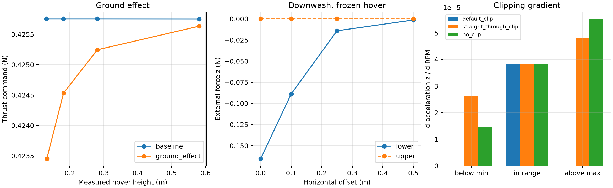

#### 15.9.2 本轮 PPO 与完整回归

回归检查均使用上述 Docker 镜像，结果与第 14 节历史计数独立：

| 检查 | 本轮结果 | 运行口径 |
|---|---|---|
| 官方完整 pytest | **771 passed, 47 skipped, 12 deselected**；410.22 s | 6 个 warning：4 条 Agg `plt.show()` 提示、2 条 contacts 相关 `overflow encountered in cast`；测试通过 |
| 官方 User Guide 可执行 Markdown | **103 passed**；45.23 s | 当前源码的文档代码块 |
| Render tests | **12 passed, 818 deselected**；23.12 s | Render 子集，未选中的其余项计为 deselected |
| 本手册关键 API | **26/26 代码块通过** | Docker 内 CPU 接口检查；GPU placement 在此项替换为 CPU |
| 新 feature / sharding | **8 组 GPU 功能 + 2 CPU 分片全部断言通过** | 原始值与环境记录见上方 JSON |

GPU 与 JAX/PyTorch DLPack 检查的正式环境记录见
[research_environment_20261009.json](usage_assets/research_environment_20261009.json)。
完整 pytest 的 skipped / deselected 仍按测试配置保留，不计作执行成功的测试。

四个 Gymnasium 任务均在 Docker / CUDA 从头重训，seed 7；4096 worlds × 64 steps
构成 262,144 transitions/update。模型、MDP 与 PPO loss 的定义沿用第 10 节；本轮按当前
`load_params(Dynamics.so_rpy, Drone.cf2x_L250)` API 读取教师参数。ReachPos/Landing 各额外进行 1000 批教师 BC（各
4,096,000 samples），PPO 内 imitation coefficient 为 10，属于 **BC + PPO + imitation**；
ReachVel/Figure-eight 不使用教师 BC。

以下命令均在容器 `/workspace/crazyflow` 执行，checkpoint 和新图使用独立日期前缀：

```bash
python usage_assets/train_gymnasium.py --env-id DroneReachPos-v0 \
  --total-timesteps 10000000 --seed 7 --num-envs 4096 --num-steps 64 --eval-envs 256 \
  --position-bc-steps 1000 --position-bc-coef 10 \
  --checkpoint saves/research_20261009_reach_pos.pt --output usage_assets/research_20261009_reach_pos.png
python usage_assets/train_gymnasium.py --env-id DroneReachVel-v0 \
  --total-timesteps 20000000 --seed 7 --num-envs 4096 --num-steps 64 --eval-envs 256 \
  --velocity-bc-steps 0 --velocity-bc-coef 0 \
  --checkpoint saves/research_20261009_reach_vel.pt --output usage_assets/research_20261009_reach_vel.png
python usage_assets/train_gymnasium.py --env-id DroneLanding-v0 \
  --total-timesteps 10000000 --seed 7 --num-envs 4096 --num-steps 64 --eval-envs 256 \
  --position-bc-steps 1000 --position-bc-coef 10 \
  --checkpoint saves/research_20261009_landing.pt --output usage_assets/research_20261009_landing.png
python usage_assets/train_gymnasium.py --env-id DroneFigureEightTrajectory-v0 \
  --total-timesteps 20000000 --seed 7 --num-envs 4096 --num-steps 64 --eval-envs 256 \
  --checkpoint saves/research_20261009_figure8.pt --output usage_assets/research_20261009_figure8.png
python usage_assets/train_gymnasium.py --env-id DroneReachVel-v0 --eval-only \
  --checkpoint saves/research_20261009_reach_vel.pt --horizontal-velocity-eval \
  --seed 7 --eval-envs 256 --output usage_assets/research_20261009_reach_vel_horizontal.png
```

实际预算只取完整 update，四任务合计 **59,768,832 PPO transitions**，另有 **8,192,000 BC
samples**。评估统一使用 256 worlds × 500 steps（10 s）、deterministic mean action、seed
10007。success 按各 world 的末 1 s RMSE 判断，并要求全程无 terminated：ReachPos / ReachVel /
Landing 阈值为 0.10 m 或 m/s，Figure-eight 为 0.15 m，Landing 还要求末秒速度 RMSE <0.10 m/s。

| 任务 | PPO transitions / updates | BC samples | 全程 RMSE | 末秒 RMSE | Survival | Success |
|---|---:|---:|---:|---:|---:|---:|
| ReachPos | 9,961,472 / 38 | 4,096,000 | 0.141301 m | **0.041216 m** | 256/256 (100%) | 256/256 (100%) |
| ReachVel，默认 3D 目标 | 19,922,944 / 76 | 0 | 0.181523 m/s | **0.073598 m/s** | 149/256 (58.20%) | 147/256 (57.42%) |
| Landing | 9,961,472 / 38 | 4,096,000 | 0.465744 m | **0.046088 m** | 256/256 (100%) | 256/256 (100%) |
| Figure-eight | 19,922,944 / 76 | 0 | 0.040200 m | **0.044990 m** | 256/256 (100%) | 256/256 (100%) |
| 同一 ReachVel checkpoint，水平目标 | 无额外训练 | 0 | 0.125064 m/s | **0.049551 m/s** | 256/256 (100%) | 249/256 (97.27%) |

水平对照只把 `vz` 固定为 0，`vx/vy` 仍在 [-1,1] m/s 中采样，其余评估设置相同。
它不能替代默认 3D 任务；向下目标受 floor/termination 约束，默认 3D 成功率仍为 **57.42%**。
Gymnasium NEXT_STEP autoreset 会让失败 world 重置后继续产生奖励，固定 500 步的 reward
sum 可以跨 reset；因此高 mean reward 或全局末秒 RMSE 不能直接解释成高 survival/success。

首个与末个 PPO update 的 rollout mean error 分别为 ReachPos `0.368256 → 0.059112`、ReachVel `1.459221 → 0.112719`、
Landing `1.042321 → 0.059659`、Figure-eight `0.613936 → 0.034690`；ReachPos/Landing 的
首个值已在 BC 之后。PPO 阶段耗时依次为
`18.18 / 44.49 / 22.86 / 28.05 s`。该时间从 rollout 循环前开始，包含循环内首 step
触发的 JIT 编译，只排除此前 BC 和环境 setup；全进程还包含 BC、setup、最终评估和绘图，分别为
`38 / 56 / 41 / 38 s`，水平单独评估为 9 s。本轮共用 GPU，时间不作为硬件排名。

完整配置、全部 history、KL/clip 日志、11 项评估指标和 checkpoint SHA-256 见
[原始 PPO JSON](usage_assets/research_ppo_20261009_results.json) 与
[本轮 PPO 报告](usage_assets/research_ppo_20261009_results.md)。reward/error/KL/clip、最终权重与
评估指标全部 finite；训练最初尚无完成 episode 时的 episode_return 占位在 JSON 中写为
`null`。本轮是单训练 seed / 单评估 seed，8 月的跨 seed 结果仍是历史数据。

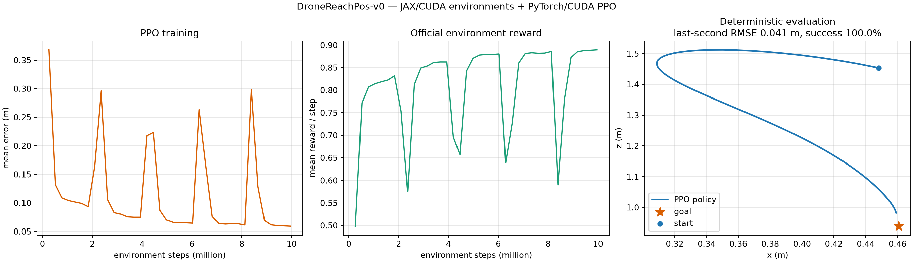

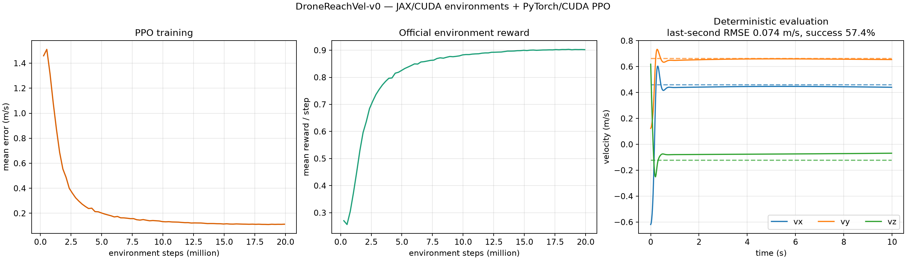

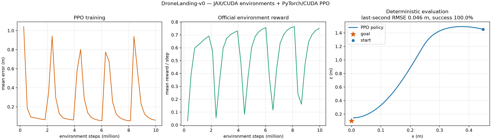

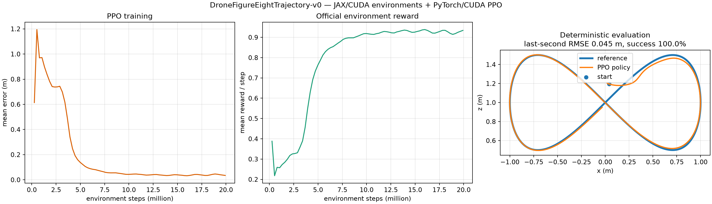

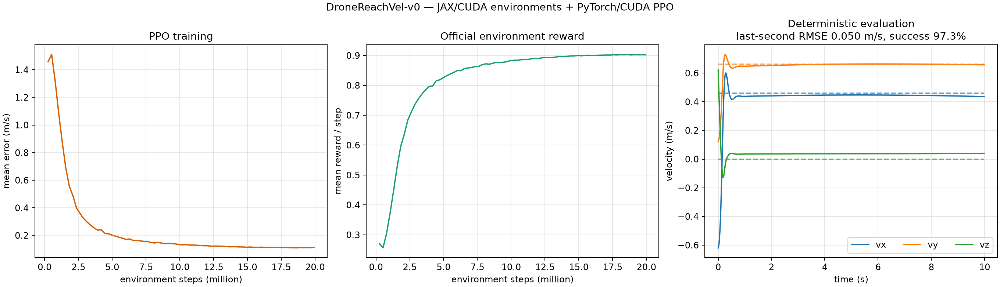

#### 15.9.3 Racing 的 Docker 训练与实赛复验

新兼容补丁在 racing 环境边界把旧 13D state action 转为 Crazyflow 的 16D；外部策略接口
仍保持原格式。单机 `level0.toml` 默认 state，双机 `multi_level0.toml` 使用 attitude。
以下在 Docker 的 `/opt/lsy_drone_racing` 执行：

```bash
python scripts/sim.py --config level0.toml --render False
python scripts/multi_sim.py --config multi_level0.toml --render False
python -m lsy_drone_racing.control.train_rl --wandb-enabled False --train True --eval 0 --render False
python -m lsy_drone_racing.control.train_rl --wandb-enabled False --train False --eval 5 --render False
```

训练使用 seed 42、1024 GPU envs × 8 rollout steps，Torch device 为 cuda、JAX environment
为 gpu；本轮 **183 updates / 1,499,136 transitions，119.39 s**。默认 checkpoint 位于
`/opt/lsy_drone_racing/lsy_drone_racing/control/ppo_drone_racing.ckpt`，本轮 SHA-256 为
`60b3a02bde2b851b9dea898a1a915ebc68cf176bab49ecbdc1c3eb35fb1cbb43`。

直接用 CLI 重载 checkpoint、关闭 render、连续评估 5 次，没有 mock 图形调用：reward
依次打印 `704.75 / 699.76 / 695.77 / 702.92 / 714.94`（CLI 保留两位小数），平均 **703.63**，每次
均为 **750 steps**。该 shaped trajectory reward 与固定 episode 长度的定义见第 12.3 节，
过门能力再由独立实赛验证：

| 控制器/场景 | 飞行时间 | Finished | Gates |
|---|---:|---|---:|
| 默认单机 state | 16.50 s | True | 4/4 |
| 双机 attitude_controller_multi | 10.10 s | True | 4/4 |
| 双机 attitude_mpc_multi | 13.43 s | True | 4/4 |
| 本轮新 checkpoint 的单机 attitude_rl | **13.34 s** | True | **4/4** |

运行新学习策略前，生成 attitude 配置（仍在容器 `/opt/lsy_drone_racing`）：

```bash
cp config/level0.toml config/level0_attitude.toml
sed -i 's/control_mode = "state"/control_mode = "attitude"/' config/level0_attitude.toml
python scripts/sim.py --config level0_attitude.toml --controller attitude_rl.py --render False
```

该 config 只改变 control mode。本轮新 checkpoint 的实赛成绩与旧章节的 13.34 s 恰好相同，
这里使用的是重新训练后已核对 SHA-256 的权重。原始 CLI 行、配置、hash 和结果见
[本轮 racing JSON](usage_assets/research_racing_20261009_results.json)。环境/API 快速复验可在
容器 `/workspace/crazyflow` 运行：

```bash
python usage_assets/research_racing_20261009_checks.py
```

该轻量检查使用 2 个 env，覆盖 JAX CPU/GPU 与 Torch CPU 的设备桥接；它补充上述完整
训练/实赛验证。历史 racing、PPO、splat 图片仍保留；本轮没有重新生成第 9 节的
GUI/web viewer 截图，不用旧图证明当前图形界面的检查结果。
